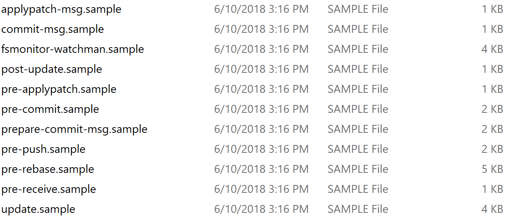

In this article you will learn how to easily create and manage git hooks for your Node/NPM projects using Husky.

## Git hooks
Simply put, git hooks are custom scripts, which can be rung automatically bu git when certain events occur. There are client-side hooks which are triggered when on actions such as commiting or merging. Server-side hooks run in situations such as receiving push data from the client.

The hooks can perform any custom logic and most importantly reject the action performed if something is not in order. For example you can abort commit if its message does does not contain issue tracker's issue ID. Or you can reject it if static code analysis fails. It can be pretty useful if you want to make sure your codebase stays clean or you want to enforce certain quality policies.

But how can you actually install and manage these hooks? Whenever you clone a git repository, all the git's data for your project are stored in `.git` directory inside your folder. It contains several files and sub-directories, one of which is called `hooks`. Inside you'll find a bunch of files.

Each of them is a script, which will be executed once a specific event occurs. The name of the event is determinded by the name of the file. So for example - `pre-commit` will be executed before you commit your changes.

As you can see, all the files have extension `sample`. Git will ignore these files unless you rename them - you need to remove the `.sample` extension to enable these hooks. Inside the sample files you can find some description and sample implementation, which you can use as a starting point when implementing your own hooks.

## What is it good for?
Now, let's look at some specific examples what can be achieved with git hooks.

    prettify
    tests
    snyk
    linting
Prblems
    distribution to team members
        git config core.hooksPath git-hooks
    windows
Husky
Autofixing w/ lint-staged
Jetbrains IDE integration
    bug
        https://github.com/okonet/lint-staged/issues/151
        https://youtrack.jetbrains.com/issue/IDEA-135454
    workaround
Ignoring
    command line option
    environmental variable    
Conclusion      
    
    