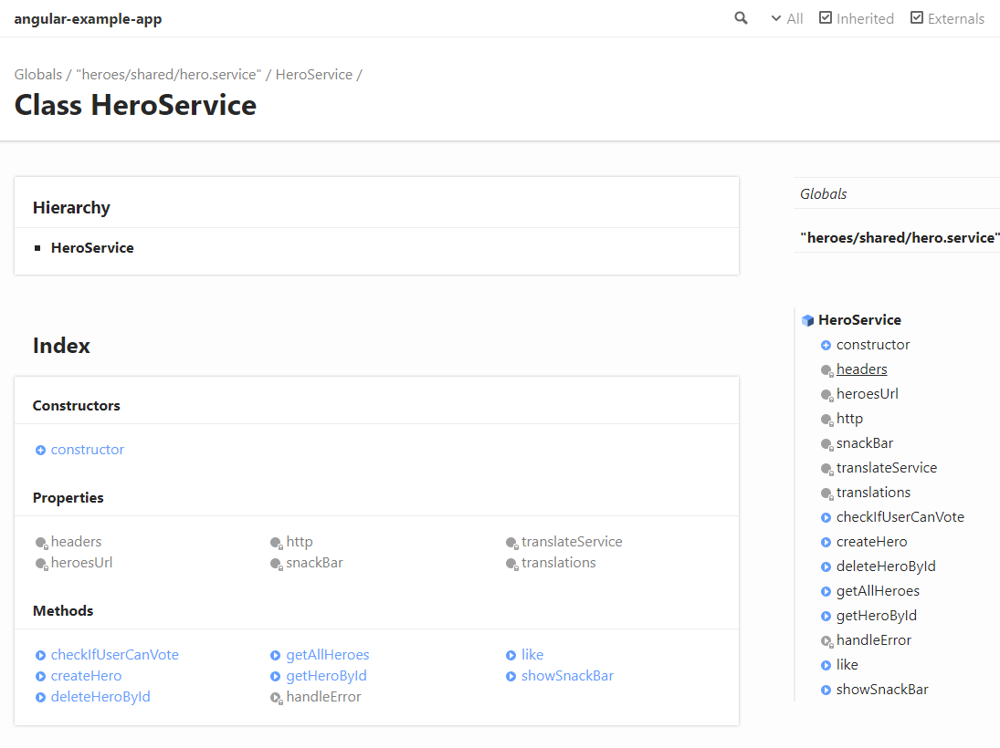
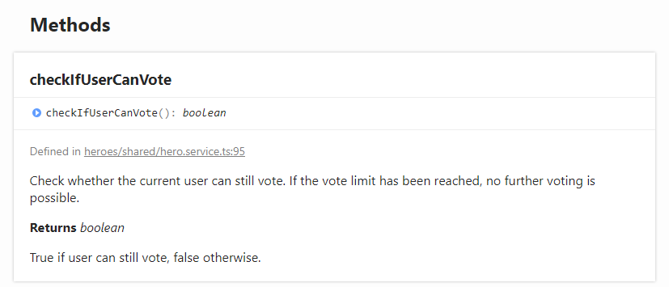
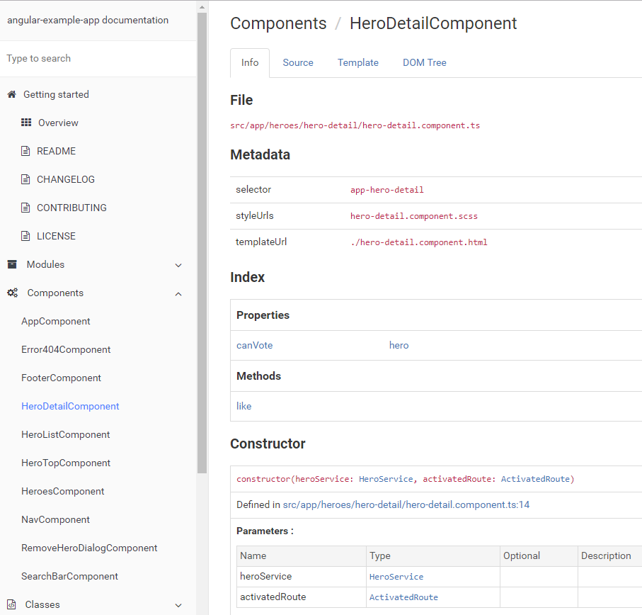
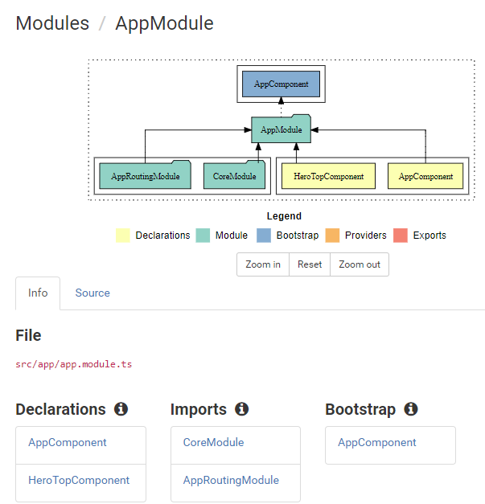
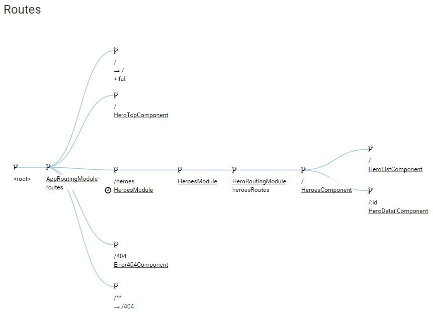
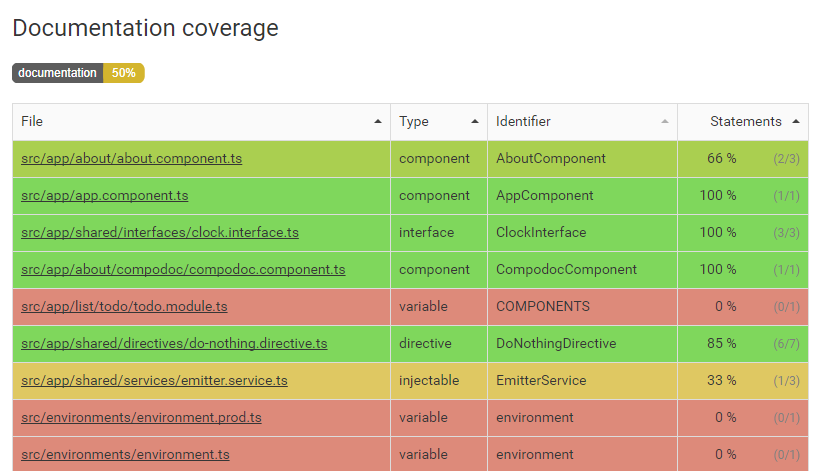

There are several tools which you can use to document your Angular 2+ app. Let's compare them so you can decide what is the most suitable for your app.

Documentation in AngularJS
--------------------------

When working with plain JS applications, you would use documentation tools specially designed for JavaScript. One of the common ones is, for example, [JSDoc](http://usejsdoc.org/). It is similar to JavaDoc tool used with Java, which can generate automatically documentation based on special comments, which are present directly in the code.

However, when working with a framework such as AngularJS (that is -- Angular 1.x), it is handy to have something more powerful. That means -- you need not only to document generic JS code, but you also want to take into consideration specifics of your framework.

For AngularJS, there is a special flavor of JSDoc called [ngdoc](https://github.com/angular/angular.js/wiki/Writing-AngularJS-Documentation). It adds a lot of angularJS specific stuff on top of regular JSDoc. It is then processed by a utility called [Dgeni](https://github.com/angular/dgeni).

Documenting TypeScript with TypeDoc
-----------------------------------

Angular 2+ is way different than AngularJS. What's more, you usually write your code not in JS, but in TypeScript. That means you cannot use JSDoc nor ngdoc. You need a new tool. Turns out, that for TypeScript, there is a tool similar to JSDoc called [TypeDoc](http://typedoc.org/). It is, however, angular-agnostic, so you cannot use any framework-specific goodies.

### Getting started

To install TypeDoc locally for your current project, just run:

```json
 npm install typedoc --save-dev
```

To be able to run typedoc as an NPM script, you need to update your package.json -- the scripts section:

```json
"scripts":{
   ...
   "typedoc":"typedoc --mode modules -module commonjs --exclude **/*.spec.ts --out docs/typedoc src/app"
}
```

After this, you can run typescript generation for your current project by simply executing *npm run typedoc*.

TypeDoc tool will be executed in mode *modules* using *common.js* modules. Exclude defines a pattern which describes files to be omitted. It is useful for example for tests. Then using \--out you are first defining output folder to which the documentation should be generated to (here it is *docs/typedoc*). The last is then the root directory containing the source code (here *src/app*).  There are many more config parameters you can use (see the [docs](https://github.com/TypeStrong/typedoc)).




TypeDoc contains two themes out of the box. The default one and 'minimal'. To specify a theme use* \--theme* option followed by the name of the predefined theme or a path to a custom one.

CompoDoc
--------

While you can use TypeDoc to document Angular apps, it will treat your code as any other plain TypeScript app. That means no Angular specific documentation. But there is a whole lot to be documented. [Compodoc](https://compodoc.github.io/website/) solves this, it is focused on Angular apps specifically giving you a much more tailored solution.

### Getting started

To install compodoc, simply run

```json
 npm install --save-dev @compodoc/compodoc
```

Then update your *package.json*

```json
"scripts": {
    "compodoc": "compodoc -p tsconfig.json"
}
```

Then you can run compodoc as a normal npm script using

```json
npm run compodoc
```

### Sample output

Once you run the compodoc command it will automatically generate your documentation from your project in form of HTML. Unlike TypeDoc, Compodoc understands that your app is an Angular application. That means it understands all the concepts such as components, pipes or directives. Bellow, you can see the generated documentation for a component.



You can see all the properties, constructors, and methods of the selected component. What\'s more, you can also view the component\'s source code, HTML template or resulting DOM structure. Since Angular applications consist of modules, it is vital to be able to document them and their relationships. Compodoc allows you to do that. You can even see relationships of each module in a nice diagram.



Compodoc also allows you to see a nice diagram of your application\'s routing, which is always handy.



One more feature worth mentioning is a documentation coverage, which allows you to measure how well commented your application is.



You can check sample Compodoc generated documentation - try the official live [demo](https://compodoc.github.io/compodoc-demo-todomvc-angular/).

AngularDoc
----------

There used to be another tool for documenting Angular applications called AngularDoc. It was similar to CompoDoc in a way that it would recognize both TypeScript and Angular-specific features. It could directly scan your Github repo and generate documentation available on AngularDoc site. At this time (Dec 2017) it is unfortunately unavailable as it is being reworked (the [website](https://angulardoc.io/main) still exists but you cannot register). According to the authors, we have something great to look forward to.

In the meantime, there are two similar products by the same company, which are still available and can be used. The first one is an [extension](https://marketplace.visualstudio.com/items?itemName=AngularDoc.angulardoc-vscode) of Visual Studio Code. The second one is called [Angular Copilot](https://angulardoc.github.io/products/). It is a standalone desktop app with similar features. Both of the products are good and helpful, but unfortunately, unlike TypeDoc and CompoDoc they cannot right away generate HTML documentation. Currently, they are more of a tool, which can help you during the development process on your local machine. For documentation purposes, we still have to wait for re-launch of the original AngularDoc. So let us stay tuned. This is a brief demo of AngularDoc VS Code Extension:


Conclusion
----------

Having application documentation is very important and unfortunately often neglected. The problem often is, that it takes a lot of effort to keep the documentation up to date. If it is not zealously maintained, it tends to rot. Once it happens, the trust in the documentation is lost and it is next to useless. It is, therefore, vital to generate as much documentation as possible automatically with every change.

Since Angular applications are usually written in TypeScript, the regular JsDoc cannot be used. There is an option to use TypeDoc instead, which is a similar tool, but just for TypeScript. A much better alternative is, however, to use a tool which understands not only TypeScript but also the Angular Framework. Currently, the best tool for the job seems to be CompoDoc. AngularDoc used to be a viable alternative, but it is currently being reworked and not available. It should be worth it to keep an eye on it to see what the new version brings once it is finished.
