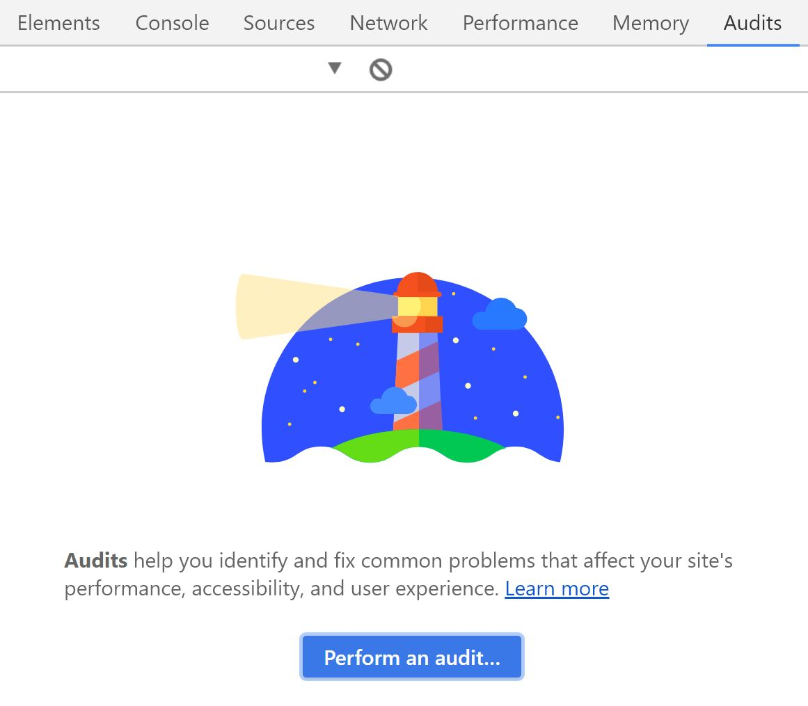
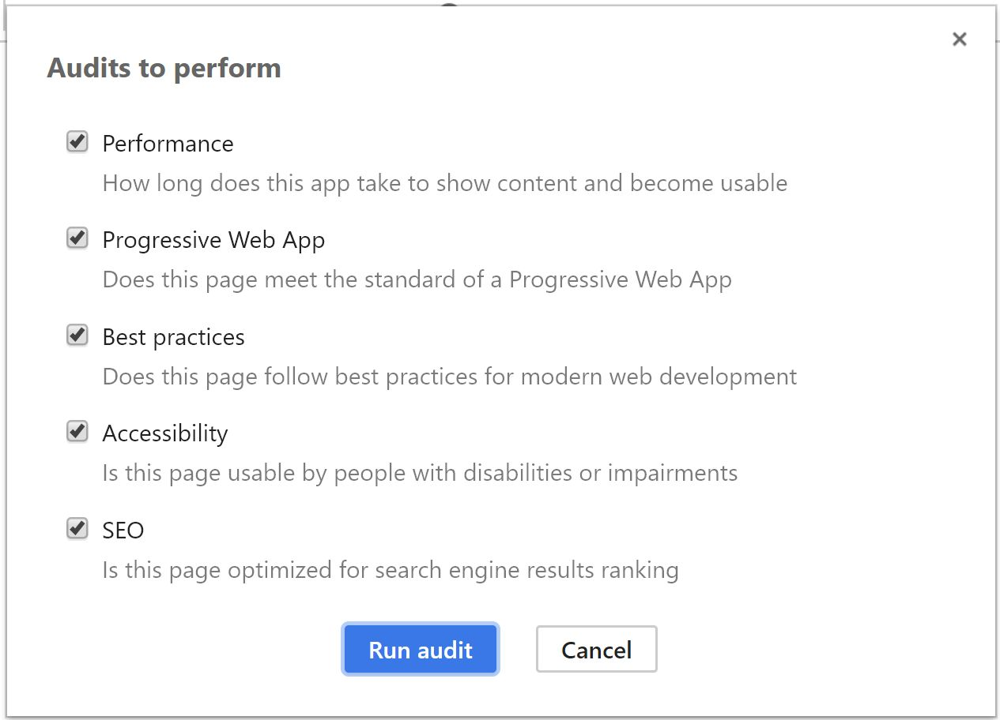
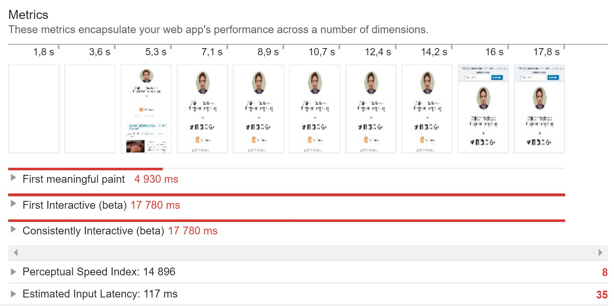
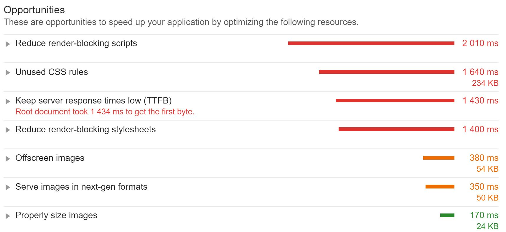
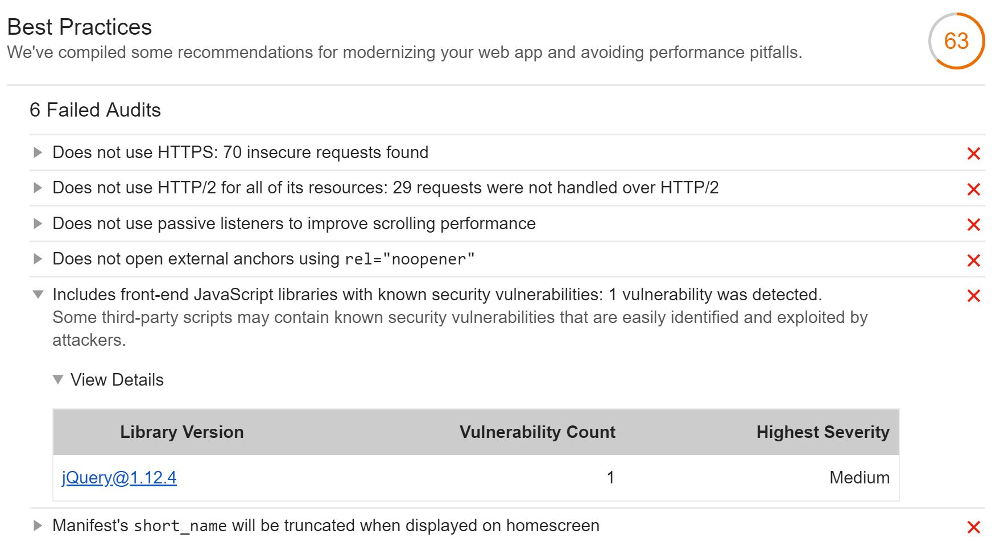

Did you know Chrome can perform a comprehensive audit of a web page and analyze many different categories such as Performance, SEO, Best Practices, Accessibility, Progressive Web Application compliance and more?
<!--more-->

Running an Audit
----------------

In version 60, Chrome introduced a great new addition to its Developer Tools. It is a comprehensive Audit feature for web pages powered by a tool called Lighthouse. It is an open source tool available on [GitHub](https://github.com/GoogleChrome/lighthouse). To run an audit, you need to open Chrome Dev Tools (F12) and select *Audit* tab:

Then you click the *Perform an Audit* button and select the categories in which you want to perform an analysis. Then just click *Run Audit*:

Chrome now analyzes your page for various potential problems in the selected categories. After the audit is done, you receive a score in each of the categories up to 100 points:

Categories
----------

In each of the categories, the score is computed based on checks which failed and which passed. You can see exactly what was successful, what not and can read details about each check. On top of this, some categories contain a list of additional manual checks - steps which cannot be validated automatically but are still important and worth testing.

### Performance

The first category is Performance. It is no doubt a very important area to focus on. Especially since many users tend to have a low-quality network connection or access your site from mobile devices. Lighthouse takes this into consideration and simulates slow network connection and slow CPU. You may be surprised how bad your site performance is under such circumstances.

Lighthouse also measures when your page first displays some meaningful information, when it becomes interactive and when it is fully operational.

But what\'s really useful is that the tool recommends you different ways how to increase the performance in your case with real data - that is how much time can you actually save by addressing various issues.

### Progressive Web App

Progressive Web Applications is a set of design principles and guidelines by Google. It should result in a smooth user experience similar to native Mobile Application. It utilizes service workers so the application can work on low-quality networks or even offline. And when online it always has up-to-date data. It should be loaded over HTTPS only, use push notifications and provide excellent load times and performance. To learn more try - [Your First PWA](https://developers.google.com/web/fundamentals/codelabs/your-first-pwapp/).

What Lighthouse does is that it tests your app against [this PWA checklist.](https://developers.google.com/web/progressive-web-apps/checklist)

### Accessibility

This section covers accessibility, that means making sure your app is usable by as many users as possible. That typically means that users with some kind of impairment or disability have as smooth experience as possible. That includes, but is not limited to, providing enough metadata for screen readers - such as ARIA attributes. The structure of your content needs to take this into account as well and you should make sure you use proper semantic elements (such as *strong* vs *b*). Your images should have proper alt attributes, form fields should have label elements attached and so on. [This accessibility guide](https://developers.google.com/web/fundamentals/accessibility/) summarizes this nicely.

### Best Practices

This category contains various miscellaneous items, such as using deprecated constructs, HTTP/2, HTTPS, console logging, password field handling and more. One item which I found really interesting and important is Detection of Javascript libraries with [known security vulnerabilities](https://www.vojtechruzicka.com/detecting-dependencies-known-vulnerabilities/). This is based on integration with a third-party tool called [Snyk](https://www.vojtechruzicka.com/snyk-detecting-dependencies-with-known-vulnerabilities/).

### SEO

This is a new category, not available in older versions of Lighthouse. It covers Search Engine Optimization. It covers mainly that your app contains enough metadata for search engines, such as HTML header meta tags, title, that page is not blocked from indexing, links have descriptive text and so on.

Lighthouse CLI and more tools
-----------------------------

### Google chrome extension

Originally, before Lighthouse was integrated as a part of Chrome Dev Tools, it was available as a standalone Chrome extension. And it still is. This may be handy if you are stuck with an older version of Chrome. Or If you want to try the newest features of Lighthouse. That\'s because stable Chrome does not include the latest and Greatest version of Lighthouse, but the extension does.

### Command Line Interface

Having Lighthouse integration directly in Chrome is neat, however, it has its limitations. You are likely to run the audit several times when it is still new and shiny or during initial development. Or when you remember to do so. But there is a constant risk that new changes will impact the performance or violate some best practices. It is much better to integrate the audit as a part of your build process to automate the whole audit thing.

Fortunately, Lighthouse is available as a [Command Line utility](https://github.com/GoogleChrome/lighthouse#using-the-node-cli) distributed as NPM package. It is also handy for cases where you need a more fine-grained configuration as it offers greater customization than Dev Tools currently. To make things even easier for your build, it offers a [Webpack Plugin](https://github.com/addyosmani/webpack-lighthouse-plugin).

### Lighthouse as a Service

If you want lighthouse integration even simpler, there is a tool called [Treo](https://medium.com/@alekseykulikov/treo-lighthouse-as-a-service-55cb9b72e8c3). It basically is Lighthouse as a Service. It offers a nice GitHub integration as well as means of breaking the build in case the expectations are not met.

Chrome Canary
-------------

Note that at the time of writing the latest version of chrome, 63, includes Lighthouse 2.5.1, which does not include some of the features described in this post. For example the whole SEO category. This post was written based on Chrome Canary 66, which includes Lighthouse 2.8.0. [Chrome Canary](https://www.techworld.com/developers/what-is-chrome-canary-should-you-use-it-3664390/) includes all the new features which will stable release contain in the future but are not yet fully tested, stable or even finalized.

Conclusion
----------

Lighthouse offers a nice way to test your web app for performance issues, PWA compliance, SEO, Accessibility and other best practices. Even though the tool is integrated nicely with Chrome Developer Tools, you may want to consider integrating it with your build process to continuously check for possible problems.