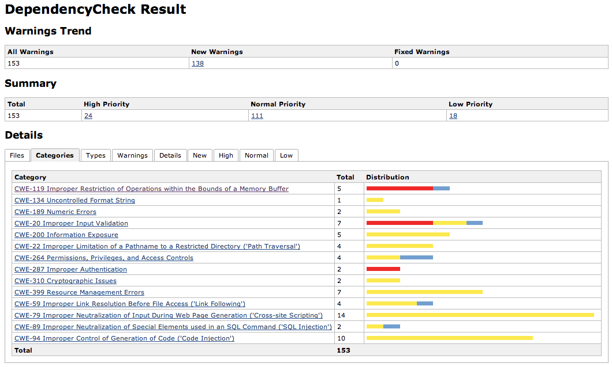

---
title: 'Detecting dependencies with known vulnerabilities   '
date: "2017-03-23T22:12:03.284Z"
tags: ['Java', 'Security']
path: '/detecting-dependencies-known-vulnerabilities'
featuredImage: './dc-large.png'
disqusArticleIdentifier: '808 http://vojtechruzicka.com/?p=808'
excerpt: 'How to automatically detect vulnerable third-party libraries as a part of your build process, integrate it with CI and track vulnerable dependencies over time?'
--- 


How to automatically detect vulnerable third-party libraries as a part of your build process, integrate it with CI and track vulnerable dependencies over time?

Vulnerable Dependencies
-----------------------

Making sure your application contains security vulnerabilities is not only about securing your own code. Your application likely contains a lot of other libraries - third-party dependencies. They introduce a lot of security vulnerabilities as well, many of which you are not even aware. Once they are discovered, they are usually fixed in a new version. When you are using an old version of a library, without recent security fixes, you are at risk. When an attacker identifies you are using an old version of particular dependency, they can easily exploit that. There are even public databases of security vulnerabilities of third-party libraries, so it is quite easy to determine which ones to exploit.

OWASP, Open Web Application Security Project, periodically releases Top Ten list of Web Application Security Vulnerabilities. \"[Using Components with Known Vulnerabilities](https://www.owasp.org/index.php/Top_10_2013-A9-Using_Components_with_Known_Vulnerabilities)\" is one of the items on their latest list:

> Components, such as libraries, frameworks, and other software modules, almost always run with full privileges. If a vulnerable component is exploited, such an attack can facilitate serious data loss or server takeover. Applications using components with known vulnerabilities may undermine application defenses and enable a range of possible attacks and impacts.

According to [The State of Open Source Security in Commercial Applications](https://info.blackducksoftware.com/rs/872-OLS-526/images/OSSAReportFINAL.pdf) study, these vulnerabilities are really widespread - on average:

-   An application has 105 open source dependencies
-   Which is 2x more than the authors were expecting
-   67% of the applications contain third-party dependency security vulnerabilities
-   22.5 vulnerability per application
-   Each of which was present there on average for 1894 days

National Vulnerability Database
-------------------------------

It is clear that it is vital to have up-to-date third-party dependencies to minimize security risk. Ideally, you would want to keep your dependencies always up to date. It is unfortunately not always possible. You may encounter a situation, where it is not so easy to update one of your dependencies. Maybe the API changed and the upgrade would involve too much refactoring. Or one of your dependencies may rely on an older version of the dependency you would want to upgrade. Or your dependencies would be incompatible in some other way.

You usually need to weigh the effort and risk of upgrading and the benefits which it provides, such as increased security. It would be nice to know exactly which vulnerabilities you current dependencies contain and how severe they are, right? Turns out there are whole databases of component security vulnerabilities such as the [National Vulnerability Database](https://nvd.nist.gov/).

Example of one such vulnerability item is [CVE-2016-9878](https://web.nvd.nist.gov/view/vuln/detail?vulnId=CVE-2016-9878).

It is, however, not realistic to check manually all your dependencies (and as we already know, an average app has 105 of them), not to mention doing this frequently. There has to be a better way.

OWASP Dependency Check
----------------------

Good news is that there is a way to check your application against the National Vulnerability Database automatically. There is an OWASP project Dependency Check, which provides a set of tools just for that. Such as - Maven plugin, Jenkins plugin, SonarQube plugin and more.

### Build

Dependency check provides integration with several common build tools - [Maven Plugin](http://jeremylong.github.io/DependencyCheck/dependency-check-maven/index.html), [Gradle plugin](http://jeremylong.github.io/DependencyCheck/dependency-check-gradle/index.html) or [Ant task](http://jeremylong.github.io/DependencyCheck/dependency-check-ant/index.html). Alternatively, there is also [Command Line Tool](http://jeremylong.github.io/DependencyCheck/dependency-check-cli/index.html). Common usage scenario would be introducing Maven Dependency Check plugin as a part of your maven build:

```xml
<build>
    <plugins>
        <plugin>
            <groupId>org.owasp</groupId>
            <artifactId>dependency-check-maven</artifactId>
            <version>1.4.5</version>
            <executions>
                <execution>
                    <goals>
                        <goal>check</goal>
                    </goals>
                </execution>
            </executions>
        </plugin>
    </plugins>
</build>
```

Then you can add configuration for the build to fail when the project contains a vulnerability of a certain severity or higher. This uses CVSS -Common Vulnerability Scoring System.

```xml
<configuration>
    <failBuildOnCVSS>6</failBuildOnCVSS>
</configuration>
```

You can also integrate Dependency Check report with the reports of Maven Site\'s plugin:

```xml
<reporting>
    <plugins>
        <plugin>
            <groupId>org.owasp</groupId>
            <artifactId>dependency-check-maven</artifactId>
            <version>1.4.5</version>
            <reportSets>
                <reportSet>
                    <reports>
                        <report>aggregate</report>
                    </reports>
                </reportSet>
            </reportSets>
        </plugin>
    </plugins>
</reporting>
```

An example application using Dependency Check Maven plugin can be found [here](https://github.com/vojtechruz/dependency-check-example). [Here](http://jeremylong.github.io/DependencyCheck/general/SampleReport.html) is the example of a report generated.

### Jenkins Integration

Dependency Check also provides a [plugin](https://wiki.jenkins-ci.org/display/JENKINS/OWASP+Dependency-Check+Plugin) for Jenkins Continuous Integration.

This way you can integrate Dependency check as a part of your Jenkins Job and check generated reports after it is run. You can, for example, schedule nightly check of your vulnerabilities to make sure your application stays secure.



### Sonar Integration

To have a constant overview of your current vulnerable dependencies and their changes over time, you can use [Dependency Check SonarQube plugin](https://github.com/stevespringett/dependency-check-sonar-plugin), which adds a widget to the Sonar dashboard.


Conclusion
----------

It is important to make sure your application does not contain high-risk security vulnerabilities caused by third-party libraries. Dependency check can help you to achieve that automatically as a part of your build or even Continuous Integration process.
