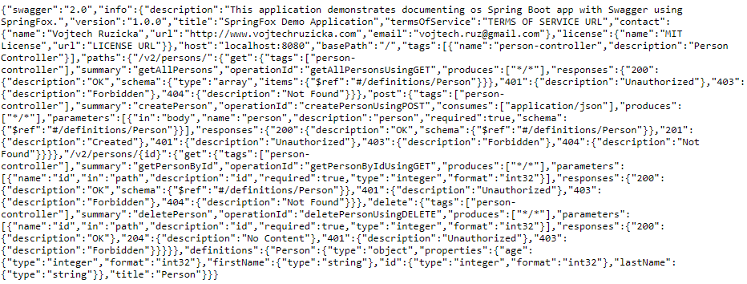
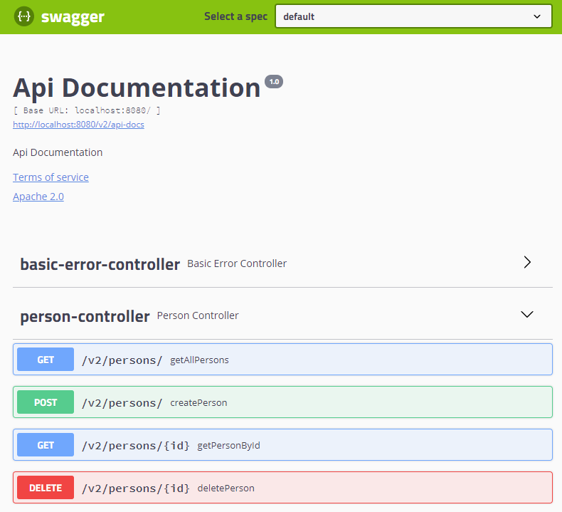
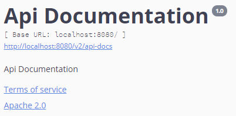
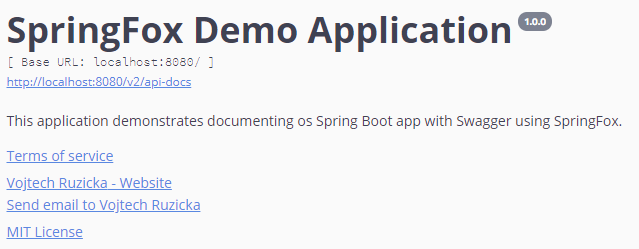
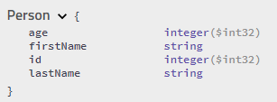
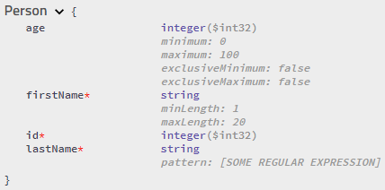
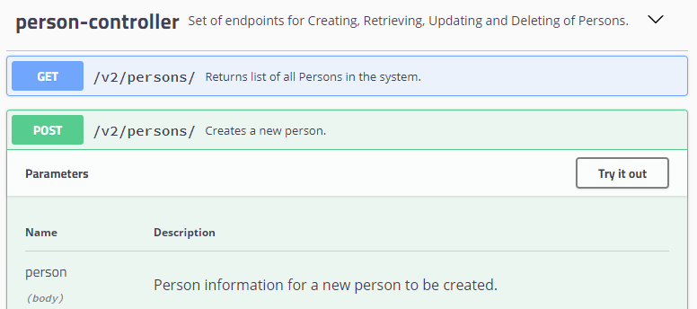

How to document your Spring Boot REST APIs using Swagger with SpringFox?
<!--more-->

Swagger and SpringFox
---------------------

Documenting your REST API is very important. It is a public interface, which other modules, applications or developers can use. Even if you\'re not publicly exposing it, it is still important. Backend and frontend code is usually worked on by different developers. The one who is creating the API is usually not the one who is consuming it. It is, therefore, crucial to have properly documented interface to avoid confusion and keep it always up to date.

One of the most popular API documentation specifications is OpenApi, formerly known as Swagger. It allows you to describe your API\'s properties using either JSON or YAML metadata. It also provides a web UI, which is able to turn the metadata into a nice HTML documentation. What\'s more, from that UI you can not only browse information about your API endpoint, but you can use the UI as a REST client - you can call any of your endpoints, specify the data to be sent and inspect the response. It\'s quite handy.

It is however not realistic to write such documentation by hand and keep it updated whenever your code changes. This is where SpringFox comes into play. It is a Swagger integration for Spring Framework. It can automatically inspect your classes, detect Controllers, their methods, model classes they use and URLs to which they are mapped. Without any handwritten documentation, it can generate a lot of information about your API just by inspecting classes in your application. How cool is that? Most importantly, whenever you make changes they\'ll be reflected in the documentation.

Starting project
----------------

To start, you\'ll need a Spring Boot application with some Rest Controllers, I\'ve prepared a simple one [here](https://github.com/vojtechruz/rest-docs-starter).

For this article, I used SpringFox 2.8.0 and Spring Boot 1.5.10.RELEASE. It uses version 2 of the Swagger specification. Version 3 is already out, but it is not yet (as of 2/2018) supported by SpringFox. The support should be available in the [next version](https://github.com/springfox/springfox/releases).

The source code of final project built with all the features described in this blog post is available on [GitHub](https://github.com/vojtechruz/springfox-example).

Adding Dependencies
-------------------

To work with SpringFox in your project, you need to add it as a dependency first. If you are using Maven, you can use the following (you can check whether a newer version is available).

```xml
<dependency>
    <groupId>io.springfox</groupId>
    <artifactId>springfox-swagger2</artifactId>
    <version>2.8.0</version>
</dependency>
```

Or if you are using Gradle:

```json
compile "io.springfox:springfox-swagger2:2.8.0"
```

Basic configuration
-------------------

After adding the dependency, you'll need to provide some basic Spring configuration. While you can technically use one of your existing configuration files, it is better to have a separate file for it. The first thing you'll need to provide is a *@EnableSwagger2* annotation. Then you need to provide a Docket bean, which is the main bean used to configure SpringFox.

```java
@Configuration
@EnableSwagger2
public class SpringFoxConfig {
    @Bean
    public Docket apiDocket() {
        return new Docket(DocumentationType.SWAGGER_2)
                .select()
                .apis(RequestHandlerSelectors.any())
                .paths(PathSelectors.any())
                .build();
    }
}
```

Of course, you can provide many more configuration settings as we'll see later, but this is a minimalistic configuration, which does the following:

-   *@EnableSwagger2* enables SpringFox support for Swagger 2.
-   *DocumentationType.SWAGGER\_2* tells the Docket bean that we are using version 2 of Swagger specification.
-   *select()* creates a builder, which is used to define which controllers and which of their methods should be included in the generated documentation.
-   *apis()* defines the classes (controller and model classes) to be included. Here we are including all of them, but you can limit them by a base package, class annotations and more.
-   *paths()* allow you to define which controller's methods should be included based on their path mappings. We are now including all of them but you can limit it using regex and more.

Adding UI
---------

If you deploy your application now, swagger metadata describing your API is already being generated! You can check it out:

```java
http://localhost:8080/v2/api-docs
```



Turns out it is just a big JSON, not very human readable. But you can already verify it works. Just go to the [Swagger Online Editor](https://editor.swagger.io/) and paste the JSON there. Paste your generated JSON to the left panel and voila! You can now see your generated documentation as HTML page. Nice, isn\'t it? It would be even nicer to have such documentation directly as a part of your application. Fortunately, it is quite easy to achieve this. The GUI displaying HTML documentation based on JSON input is called *swagger-ui*. To enable it is a Spring Boot app, you just need to add this dependency:

```java
//MAVEN
<dependency>
    <groupId>io.springfox</groupId>
    <artifactId>springfox-swagger-ui</artifactId>
    <version>2.8.0</version>
</dependency>

//GRADLE 
compile "io.springfox:springfox-swagger-ui:2.8.0"
```

The documentation will be automatically available here:

```json
http://localhost:8080/swagger-ui.html
```



Adding ApiInfo
--------------

By default, the header part of our documentation does look pretty generic:



It's time to do something about it. We can change all the information there just by a simple configuration change. In the *SpringFoxConfiguration* file, we need to add *ApiInfo* object, which provides general information about the API such as title, version, contact or licensing information.

```java
@Bean
public Docket apiDocket() {
    return new Docket(DocumentationType.SWAGGER_2)
            .select()
            .apis(RequestHandlerSelectors.any())
            .paths(PathSelectors.any())
            .build()
            .apiInfo(getApiInfo());
}

private ApiInfo getApiInfo() {
    return new ApiInfo(
            "TITLE",
            "DESCIPRION",
            "VERSION",
            "TERMS OF SERVICE URL",
            new Contact("NAME","URL","EMAIL"),
            "LICENSE",
            "LICENSE URL",
            Collections.emptyList()
    );
}
```

Now our documentation header should look much better:



Narrowing down processed APIs
-----------------------------

So far so good. But when you take a closer look at the generated documentation, you'll see that in addition to our Model and Controller classes which we use, there are also some spring specific classes such as *BasicErrorController* in the Controllers\' sections and also *View* and *ModelAndView* under Models section.

Sometimes it is useful to narrow down classes which will SpringFox detect as sources for documentation generation. Both Controller and Model classes. You can easily configure this in the Docket configuration. Remember like we used *.apis(RequestHandlerSelectors.any()* to include all the classes? Let's narrow it down just to our base package:

```java
@Bean
public Docket apiDocket() {
    return new Docket(DocumentationType.SWAGGER_2)
            .select()
            .apis(RequestHandlerSelectors.basePackage("com.vojtechruzicka"))
            .paths(PathSelectors.any())
            .build()
            .apiInfo(getApiInfo());
}
```

This is useful when you want to specify which classes should be included. Sometimes you also need to include only specific URL paths. Maybe you are using multiple versions of your API for backward compatibility but don't want to include the historical ones. Maybe some part of the API is internal and should not be part of the public documentation. Either way, such inclusion based on URL matching can also be configured in the Docket. Remember *.paths(PathSelectors.any())*? Instead of any, which matches all the paths, you can limit it just to some regex or [Ant-style path patterns](http://ant.apache.org/manual/dirtasks.html#patterns).

```java
@Bean
public Docket apiDocket() {
    return new Docket(DocumentationType.SWAGGER_2)
            .select()
            .apis(RequestHandlerSelectors.basePackage("com.vojtechruzicka"))
            .paths(PathSelectors.ant("/v2/**"))
            .build()
            .apiInfo(getApiInfo());
}
```

In case built-in options are not enough for you, you can always provide your own predicate for both *apis()* and *paths()*. An alternative way of ignoring certain classes or methods is to annotate them with *@ApiIgnore*.

Using JSR-303 annotations
-------------------------

[JSR 303: Bean Validation](https://dzone.com/articles/bean-validation-made-simple) allows you to annotate fields of your Java classes to declare constraints and validation rules. You can annotate individual fields with rules such as -- cannot be null, minimal value, maximal value, regular expression match and so on.

```java
public class Person {
    @NotNull
    private int id;

    @NotBlank
    @Size(min = 1, max = 20)
    private String firstName;

    @NotBlank
    @Pattern(regexp ="[SOME REGULAR EXPRESSION]")
    private String lastName;

    @Min(0)
    @Max(100)
    private int age;

    //... Constructor, getters, setters, ...
}
```

This is a common practice which is already widely used. The good news is that SpringFox can generate Swagger documentation based on such annotations, so you can utilize what you already have in your project without writing all the constraints manually! It is very useful as consumers of your API know what are restrictions on the values they should provide to your API and what values to expect. Without the inclusion of such annotations, the generated documentation for our person model looks rather plain, nothing except for field names and their data type.



With data from JSR-303 annotations, it will look much better:



Unfortunately, JSR-303 based documentation does not work out of the box, you need an additional dependency:

```java
//MAVEN
<dependency>
   <groupId>io.springfox</groupId>
   <artifactId>springfox-bean-validators</artifactId>
   <version>2.8.0</version>
</dependency>
 
//GRADLE
compile "io.springfox:springfox-bean-validators:2.8.0"
```

And you need to import *BeanValidatorPluginsConfiguration* configuration file on top of your swagger configuration class:

```java
@Configuration
@EnableSwagger2
@Import(BeanValidatorPluginsConfiguration.class)
public class SpringFoxConfig {
  ...
}
```

Adding Swagger Core annotations to your model classes
-----------------------------------------------------

The advantage of using JSR-303 is that if you already use them you get extra documentation information with zero effort and without changing any code. The problem is that currently, SpringFox does not display validation messages specified in the annotations. Also, you may have some more complicated constraints you need to document. In such cases, you can use [Swagger Core annotations](https://github.com/swagger-api/swagger-core/wiki/Annotations), which allow you to specify additional information such as description. Person Class annotated with these annotations can look something like this.

```java
@ApiModel(description = "Class representing a person tracked by the application.")
public class Person {
    @ApiModelProperty(notes = "Unique identifier of the person. No two persons can have the same id.", example = "1", required = true, position = 0)
    private int id;
    @ApiModelProperty(notes = "First name of the person.", example = "John", required = true, position = 1)
    private String firstName;
    @ApiModelProperty(notes = "Last name of the person.", example = "Doe", required = true, position = 2)
    private String lastName;
    @ApiModelProperty(notes = "Age of the person. Non-negative integer", example = "42", position = 3)
    private int age;

    // … Constructor, getters, setters, ...
}
```

On the class level, you use *@ApiModel* annotation and on field level *@ApiModelProperty*. You can, of course, mix and match with JSR-303 annotations. *@ApiModelProperty*\'s example is useful for providing example values, which is good not only for the guidance of users but also it is used to prefill a request payload when using Swagger UI as a REST client to test your services. Position attribute is handy to specify the order in which attributes will be displayed in the documentation. It is useful to provide important or required attributes first or group attributes which belong together. Otherwise, the attributes will be listed alphabetically.

Adding Swagger Core annotations to your controller classes
----------------------------------------------------------

Same as you could annotate your model classes with Swagger core annotations to provide additional metadata, you can annotate your controllers and their methods and method parameters.

-   *@Api* describes the whole controller
-   *@ApiOperation* is used for description on a methods level
-   *@ApiParam* is used for method parameters

```java
@RestController
@RequestMapping("/v2/persons/")
@Api(description = "Set of endpoints for Creating, Retrieving, Updating and Deleting of Persons.")
public class PersonController {

    private PersonService personService;

    @RequestMapping(method = RequestMethod.GET, produces = "application/json")
    @ApiOperation("Returns list of all Persons in the system.")
    public List getAllPersons() {
        return personService.getAllPersons();
    }

    @RequestMapping(method = RequestMethod.GET, path = "/{id}", produces = "application/json")
    @ApiOperation("Returns a specific person by their identifier. 404 if does not exist.")
    public Person getPersonById(@ApiParam("Id of the person to be obtained. Cannot be empty.")
                                    @PathVariable int id) {
        return personService.getPersonById(id);
    }

    @RequestMapping(method = RequestMethod.DELETE, path = "/{id}")
    @ApiOperation("Deletes a person from the system. 404 if the person's identifier is not found.")
    public void deletePerson(@ApiParam("Id of the person to be deleted. Cannot be empty.")
                                 @PathVariable int id) {
        personService.deletePerson(id);
    }

    @RequestMapping(method = RequestMethod.POST, produces = "application/json")
    @ApiOperation("Creates a new person.")
    public Person createPerson(@ApiParam("Person information for a new person to be created.")
                                   @RequestBody Person person) {
        return personService.createPerson(person);
    }

    @Autowired
    public void setPersonService(PersonService personService) {
        this.personService = personService;
    }
}
```

Now your documentation should contain also the descriptions provided:



Note that our controller and domain classes are now plagued with Swagger specific annotations. The readability suffers a lot as the important information gets lost in a lot of fluff. What\'s worse - documentation written this way does not get updated when you change the code, you\'ll need to remember to change the messages manually. This increases the risk of your docs being out of sync and thus not trustworthy. It is good to include just the essential information which is not obvious and which is not already covered well by auto-generated information. Having descriptive names of parameters along with JSR-303 annotations can usually document most of the required information.

Loading Description from properties files
-----------------------------------------

Providing descriptions directly in the annotations is not very elegant. It can take a lot of space, polluting your code. You cannot really support multiple languages. When you want to fix a typo or make some changes to the documentation, you need to rebuild and redeploy your whole application. You cannot have different values based on environment. Not very flexible. Fortunately, Spring provides a concept of Property placeholders. In short, it allows you to provide a placeholder \${placeholder} instead of a hardcoded value. Then you define the value of the placeholder in a .properties file. Spring loads the data from the properties and injects it instead of the placeholder. What\'s cool is that you can provide multiple property files for each language one. You can provide different property files in different environments. They can just be on the classpath so you don\'t have to rebuild and redeploy the whole app, just change the property file.

SpringFox supports this mechanism in some of the annotations. It is a nice way to decouple your documentation from your code and have a bit more flexibility. Unfortunately, currently, there is support [only for some of the annotations](http://springfox.github.io/springfox/docs/current/#support-for-documentation-from-property-file-lookup). So for example in the model, they support it on method level (*@ApiModelProperty*), but not on class level (*@ApiModel*).

To make this work you need to:

1.  Create a property file, e.g. *swagger.properties*
2.  Enter your desired messages as key-value pairs where key will be used as placeholder - e.g. *person.id=Unique identifier of the person*
3.  Instead of annotation text insert a placeholder - e.g. *\${person.id}*
4.  Register the property file in your configuration on class level - eg. *@PropertySource(\"classpath:swagger.properties\")*

Conclusion
----------

SpringFox is a useful tool, which can automatically generate Swagger documentation based on your Spring controller and model classes. It can also recognize JSR-303 annotations, so you\'ll have also documented all the constraints on your model classes. It can also utilize core swagger classes such as @ApiModelProperty. Be careful though as this plagues your code with a lot of swagger specific annotations. It is always better to use them only when SpringFox cannot infer the information itself. Use them only when you need to add some description where the class, attribute, and methods names are not self-explanatory. Then again, it may be a red flag that your API is cryptic or too complicated. If you leave the majority of your documentation automatically generated by SpringFox, you can be sure that it is always up to date. Otherwise, you need to be really careful to update the Core Swagger annotations when making changes in your code. If your docs and code are not matching, users will lose trust in your API documentation and such documentation is next to useless.
