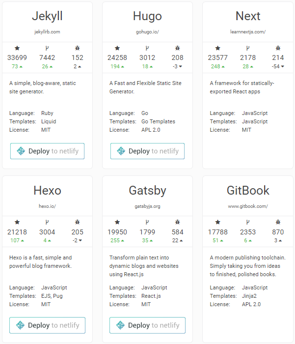

How and Why I migrated from WordPress to static JAM Stack site build with Gatsby JS.

#Before
When I started my blog back in 2016, I wanted to focus as much as possible on creating content rather than
creating the blog infrastructure. Of course, there was a siren's call to build everything from scratch or spend weeks
researching all the possible platforms. It would be no doubt a lot of fun. But I resisted as I wanted to start as soon as possible. 
Because back then, I wanted to start my blog for a few years already and I wanted to reduce the barrier of entry as much as possible.
I knew the most critical part is to build a habit of writing regularly and then I can polish my blog later.

So WordPress was obvious choice for me because it is widespread, with a lot of resources and plugins available. And it worked well. More or less. There were issues though. Most notable one was performance. WordPress is sluggish. Especially once you add some plugins.
The results of a [Lighthouse audit](https://www.vojtechruzicka.com/chrome-audit-lighthouse/) were disappointing:

Especially the performace. With such long page load times, many users just leave before the page fully loads. Especially when on mobile and low quality connections. Another issue is security. With majority of web powered by WordPress, it is target of automated attacks all the time. That means constant fear of losing your precious content. And it's internal database storing all the content was pretty much black box for me. And of course, there const involved. As I din't want to manage my installation, keep it updated and in good shape, I paid for hosted solution. Last but not least, Wordpress is build with PHP, which I am not familar with and it is something I am not eager to learn. That means that any customizations or tweaks are out of question for me.

##JAM Stack
Long story short, I decided to get rid of my WordPress and replace it with much more lightweight solution. There was a brief moment where I considered using Medium instead, but I decided I value control of my own content more. After listening to a very inspiring lightning talk by [Ladislav Prskavec](https://twitter.com/abtris/) about JAM Stack, I decided its time to give it a try. 

    TODO
    what is it
    why is it useful
    security
    speed
    CDN
    SEO - google favors speed

##GatsbyJS
Alright, JAM Stack is a way to go, no doubt about that. Which of the static site generator to use though? A good place to start is site called [StaticGen](https://www.staticgen.com/), which contains a nice list of many Static Site Generators. You can filter by language and templating used. And sort by popularity. That's a good way to determine what generators are currently widely used, which is important because it determines community site, resources and plugins available. Currently there is 214 generators and the number is constantly growing. So which one should I choose?

There are many factors to consider. Maturity is important as it means a big community, lot of resources, plugins and stable bug-free product. On the other hand it is often trade-off between maturity and new features and technologies. Then of course there is language used. If you need to customize the generator and tinker with it, you'll want to use one written in a language you're familiar with. After briefly checking top 5 generators, I declined Jekyll or Hugo as Go or Ruby were not languages I am familar with. From the remaining generators Gatsby immediately caugh my attention because of its features and modern technologies.

###Modern technologies
Gatsby is build with a lot of interesting technologies. If you are front-end developer, you'll probably be familar with most of these, so adoption should be quick. If not, it gives you chance co lear a lot of interesting stuff. Gatsby is powered by React. You'll be able to to nicely structure your project to components and use all the existing React components there not specifically developed for gatsby. For styling, you can attach plain old CSS stylesheet, but gatsby offers many more choices like SASS, Glamor, Styled Components, Stylus, LESS or Styled JSX. Gatsby is build on top of Webpack. Gatsby can generate offline-ready Progressive Web App and uses GraphQL for querying data.

###Data sources and GraphQL
One of the disadvantages of WordPress is that is tightly couples creation and management of content and serving of the content. While for many WP may be a nice way to create and manage their content, it is far from efficient for serving the content compared to static sites. In contrast, this is one of the areas where Gatsby really shines. 

From your react components and templates, you access data (such as blog posts, site title and other metadata) using GraphQL. Unlike other Static Site Generators, the data is not limited to Markdown or some templating language. Gatsby supports many sources. It can handle files in formats such as Markdown, YAML, CSV or XML. What's really awesome is that it can connect to sources like Medium or WordPress and load data from there! And because of Gatsby's extensibility and plugin system it is easy to add more sources. What's great is that from the perspective of your templates it is just a GraphQL query. That means it is easy to switch data sources while your components and tempaltes remain intact. For example, when migrating from WordPress, you can keep your articles in WP, keep greating and updating them there and just use Gatsby to transform your WP site to static one. Then, later you can convert to markdown if you feel like it.

What's really powerful is using GraphQL as the query language. Because when querying structured data, you define what fields are you interested in, you can define order or limit the number of the result. But everyting is defined on the side of the client executing the query. You can change your queries and data obtained without modifyng the data source. It also means you can query the same source in different ways depending on context.

###Performance
One of the Gatsby's greatest advantages is performance. I mean - performance on to of what you get by switching to a static site generator. Since gatsby uses webpack, it allows code splitting by route. That means when accessing a page on your site, the client will download only code and resources necessary for the current sub-page and not the whole bundle. When navigating to another route, it will just fetch what's new. Gatsby also stick to the Progressive Web App standard. That means your site can behave as native-like app on mobile and work with poor connections or even offline. What's more, Gatsby utilizes PWA's [PRPL Pattern](https://developers.google.com/web/fundamentals/performance/prpl-pattern/). That means first push critical resources over HTTP/2 to the client, which is faster than waiting for browser to download HTML first, parse it and then request additional stylesheets, scripts and resoruces. Gatsby first renders static-html version of the initial route to minimize time-to-interactive. Then on the background it loads the bundle and initializes Single-Page App. It starts to pre-fetch resources for the routes linked to the inital page so additional navigation on within your site is blazing fast and without reload.

Gatsby works also great with images, which are usually a big hit to site's performance. Based on the screen size and resolution of the client device, it will serve appropriate image size to the client. It supports WebP and can convert your jpegs to progressive jpegs. While the images are loading, it will reserve the space required by the image, so the content of the page is not 'hopping' after image loads. It also replaces the image with blurred version or monochromatic svg similar to what Medium uses.
        
##Pitfalls
I personally think Gatsby is great. I had a lot of fun using it so far and I've learnt a lot in the process. It offers you a lot of freedom and flexibility. However, it is not as mature as some of the competitors. This is improving quickly as it is under rapid development. However, I did encounter some bug complicating my development. On the other hand the community was really helpful and supportive. Some of the features, which I would consider standard was not yet available or sufficient such as tags and categories support, pagination or Open Graph metadata. I would also like to see AsciiDoc support instead of markdown. One of the biggest problems was probably lack of visual themes. For a long time, there was not any offical themes directory. In Feb 2018 [Gatsby Manor was launched](https://www.gatsbyjs.org/blog/2018-02-09-announcing-gatsby-manor-themes-for-gatsbyjs/) and now it contains just SIX themes, which are all just ports of [HTML5 UP themes](https://html5up.net/). However, with the current development rate I am sure more and more plugins will be available out of the box in the near future.
    
##Results    
Overall I am really happy with Gatsby and the migration from WordPress. I no longer fear my WordPress will get compromised. Everything is now on github and under version control. No longer need of database backups and rolbacks are now easy in case of something goes wrong. Not to mention the possibility of developing new features safely in branches and deploying and testing them separately from the 'production' environment. And no more fees for hosted WordPress. And writing in markdown is also more convenient for me as I don't focus on html or visuals when writing but rather on the content.

My blog is now deployed on Netlify CDN, which means user will be served fast no matter what their geograhic location is. The performace gain of switching to static is huge. That means not only less visitors leaving the blog because of the slow loading times, but also better page ranking on Google as it favors faster sites. It also favors sites served over HTTPS, which my site now supports thanks to Netlify's [one click setup](https://www.netlify.com/docs/ssl/) and [Let's Encrypt](https://letsencrypt.org/). Now let's go back to the Lighthouse audit score and compare new Gatsby site to the good old WordPress.

###Before

###After

Long story short - Gatsby is great. You should give it a try, especially if you are front-end developer. And keep watching its development as I am sure we can look forward to even more awesomeness in the future. 

To learn more about Gatsby Check [this curated list](https://github.com/prayasht/awesome-gatsby) of Gatsby-related resources.