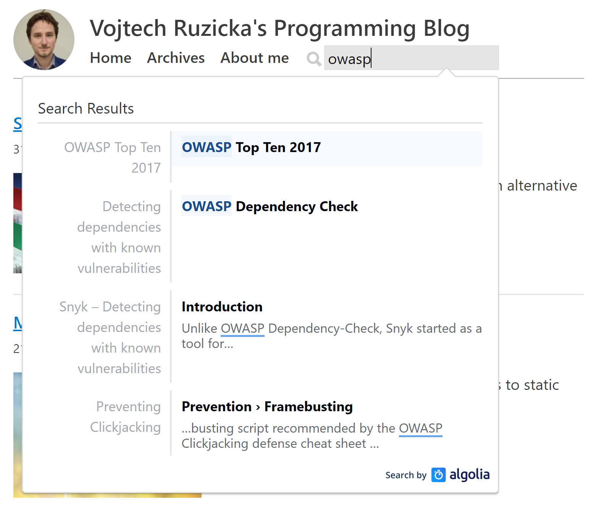
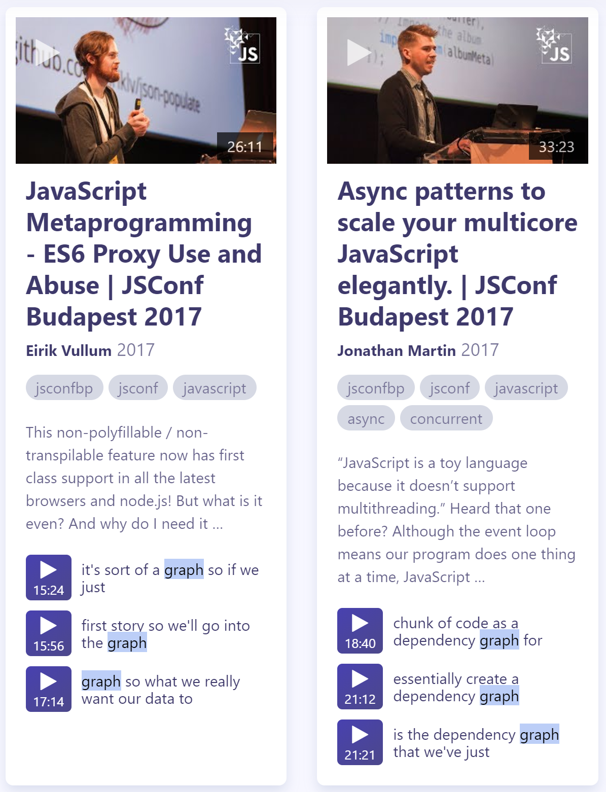

## Searching static sites
A few months ago I finally managed to migrate my blog from WordPress to a static site build with GatsbyJS and deployed on [Netlify](https://www.vojtechruzicka.com/jamstack-migration-netlify/).

<div class="linked-post"><h4 class="front-post-title" style="margin-bottom: 0.375rem;"><a href="/gatsby-migration/" style="box-shadow: none;">Migration to GatsbyJS and JAM stack from WordPress</a></h4><small class="front-post-info"><span class="front-post-info-date">25 March, 2018</span><div class="post-tags"><ul><li><a href="/tags/blogging"><!-- react-text: 292 -->#<!-- /react-text --><!-- react-text: 293 -->Blogging<!-- /react-text --></a></li><li><a href="/tags/jam-stack"><!-- react-text: 296 -->#<!-- /react-text --><!-- react-text: 297 -->JAMStack<!-- /react-text --></a></li></ul></div></small><div><a class="front-post-image" href="/gatsby-migration/"><div class=" gatsby-image-outer-wrapper" style="position: relative;"><div class=" gatsby-image-wrapper" style="position: relative; overflow: hidden;"><div style="width: 100%; padding-bottom: 66.6667%;"></div><noscript></noscript></div></div></a><span class="front-post-excerpt">How and Why I migrated from WordPress to static JAM Stack site built with Gatsby JS.</span></div></div>

I was very impressed with the results of the migration, especially performance-wise. I was able to migrate all the functionality, except site-wide search.

With server generating your pages, searching is easy. WordPress offers search option out of the box. With static sites, which have no dynamic backend, this gets trickier. 

## Client-side search
One option to enable search for your application is to use full client-side search with libraries such as [js-search](https://github.com/bvaughn/js-search). The idea is simple. When you build your static site using your favorite static site generator, you also generate a search index of your pages. That basically means generating a lot of JSON with the contents of your site and then distributing this along with your static files. The search is lightning-fast because everything happens on the client. The problem is that this solution may not be good for full-text search. Bringing this much data to the client just for search can mean a significant performance hit. Especially if your site has a lot of content. Moreover, just a fraction of users is likely to use the search option. The rest just download useless junk. You sacrifice one of the greatest advantages of going static - performance just for adding a search option.
 
## Good old Google Custom Search
All right, so for full-text search, it may not be such a good idea to download the whole search index to the client. Since our static site does not have a dedicated backend, we need to use third-party to handle the search. The first obvious choice is to use Google search. [Google Custom Search](https://cse.google.com) to be precise.

The advantage is it doesn't need to download the whole search index. You use Google to search your site only. There are some disadvantages though. First one is that Google injects ads to your search results. The second one is that even though you can customize the look and feel of the search results page to some degree, it is still obvious that you utilize Google. The results page will likely not fit very well the look and feel of your page and arguably it does not look very well integrated and professional. Especially with the ads. Like you didn't care enough to provide custom search as other sites do.

TODO image of google custom search

Alternatively, if you don't mind doing some extra work, custom search offers an [API](https://developers.google.com/custom-search/json-api/v1/overview), so you can retrieve results programmatically and seamlessly integrate them in your page. This, however, somewhat negates the most significant advantage of Google Custom search, which is its easy setup.

If you don't care about the downsides much, this can be very easy and quick way to add search for your static site. If you don't like it, there are still alternatives.

## Algolia DocSearch
[Algolia DocSearch](https://community.algolia.com/docsearch/) is similar to Google Custom Search in a way that you don't need to download the whole search index to the client and that the search is provided by third-party service.

There are some advantages over Google Search though. First of all, no ads. Also, everything integrates with the look and feel of your site nicely as you just mark a text input on your page as a search box to be handled by DocSearch. It then attaches autocomplete functionality to this search box. Whenever you start typing you get results from DocSearch. Directly in your page with possibility to easily override default styles. So the setup is really easy and your pages are indexed for you automatically.



### Requesting access
The first step you need to make is to request DocSearch for your site. Just fill a simple form on [their website](https://community.algolia.com/docsearch/).


If your request gets approved, you're good to go. They will configure the crawler for your site, which will gather search data once a day. And they will send you JS and CSS to include on your page to enable the search. That's it.

But your request may get rejected (as in my case) because DocSearch is primarily intended as a solution for searching documentation pages of open source projects.

However, after the initial rejection, I did ask nicely whether they can provide the service for my blog. They were really kind to me and allowed me to register. 

> DocSearch focuses on documentation content that helps the community. It looks like your content is helpful this why we will provide you DocSearch.

### DocSearch on your own infrastructure
However, even if your request is rejected, nothing is lost. The whole DocSearch is open-source and you can install and run it [on your own infrastructure](https://community.algolia.com/docsearch/documentation/docsearch-scraper/overview/). It's a viable alternative as the search metadata is still managed and stored externally and collected by DocSearch crawler.

### Setup and configuration
One of the advantages of DocSearch how easy it is to set up and configure. You just need to add the following to your page (Algolia team provides you with exact values and details after the registration):

```html
<!-- at the end of the HEAD --> 
<link rel="stylesheet" href="https://cdn.jsdelivr.net/npm/docsearch.js@2/dist/cdn/docsearch.min.css" /> 

<!-- at the end of the BODY --> 
<script type="text/javascript" src="https://cdn.jsdelivr.net/npm/docsearch.js@2/dist/cdn/docsearch.min.js"></script> 
<script type="text/javascript"> docsearch({ 
 apiKey: '### PROVIDED  BY ALGOLIA ####', 
 indexName: '### PROVIDED  BY ALGOLIA ####', 
 inputSelector: '### REPLACE ME ####', 
 debug: false // Set debug to true if you want to inspect the dropdown 
}); 
</script> 
```

You just need to provide proper selector (such as CSS class or id) for the input search element. Algolia team also configures the project for you and they store the configuration file in their git repo. In case you need to make any changes, you just create a Pull Request, which gets quickly merged. In the config file, you define a hierarchy of your pages sections. That means, for example, that H1 headings have more weight in search results than H2. And H3 have even less weight. Ordinary paragraphs have the least relevance. With custom selectors you can define where precisely in your page is your content, so you can easily ignore sections such as footer or navigation. Here is an example of a simple configuration for my site:

```json
{
  "index_name": "vojtechruzicka",
  "start_urls": [
    "https://www.vojtechruzicka.com"
  ],
  "stop_urls": [],
  "selectors": {
    "lvl0": {
      "selector": "",
      "global": true,
        "default_value": "Search Results"
    },
    "lvl1": ".docSearch-content h1",
    "lvl2": ".docSearch-content h2",
    "lvl3": ".docSearch-content h3",
    "lvl4": ".docSearch-content h4",
    "text": ".docSearch-content p, .docSearch-content li"
  },
  "conversation_id": [
    "593663647"
  ],
  "nb_hits": 1890
}
```

If you're looking for a more complex example, you can check [configuration of GatsbyJs](https://github.com/algolia/docsearch-configs/blob/master/configs/gatsbyjs.json).

## Algolia Search
DocSearch is primarily focused on documentation and full-text search. However sometimes you need something more powerful and sophisticated. In such case, Algolia's flagship product - Algolia Search is better for you.

Instead of working with the full text of your pages, you can define your own structured data in the form of JSON objects and Algolia works with them. Each of these objects can have many properties and you can search across all of them.

On top of this Algolia offers many advanced features, which are not available in DocSearch. You can define how the search results should be ranked, so the user receives the most relevant results. You can define synonyms for search terms. You can provide correction alternatives to common typos. There is a nice dashboard and search logs. You can even have analytics with a paid plan.

### Uploading search data
Algolia does not crawl your content automatically as DocSearch does. You need to upload your data to their servers using REST [API](https://www.algolia.com/doc/api-reference/). They offer clients for a number of languages and frameworks such as Java, C#, PHP, Python, Django, Laravel, Rails or Symfony.

While this may be useful for traditional applications, it is not of much use for static sites. In this case, you need to build your JSON objects as a part of building your static site and then upload them using their REST API.

Of course, you can do it manually and it will work. With some static site generators, it is your only option. Fortunately, some of the generators provide plugins for Algolia, which make the process much easier. For example there is a plugin for [Jekyll](https://github.com/algolia/jekyll-algolia) or [GatsbyJs](https://github.com/algolia/gatsby-plugin-algolia) (as of 6/2018 in beta). 

## Search your videos
If you also work with videos, Algolia offers another exciting service. It is called [Algolia TalkSeach](https://community.algolia.com/talksearch/). It allows you to add search to your youtube videos. It fetches transcript for the video and makes it searchable, so you can easily navigate to the part of the video you are interested in. 



It is intended primarily for conferences and meetups, but again, they may be kind enough to make an exception for you. 

## Conclusion        
When adding search to static sites, you need a different approach than in traditional apps where your backend can handle the search for you. Adding Google Search can be quick and painless, but the customization is limited and it does not feel like a nice integrated solution. 

Having client-side search offers a fast solution, which can be good if you want your app to work offline as a Progressive Web App. Of course, you need to download the whole search index to the client, which can be too much once you have a lot of content.

Algolia DocSearch is an easy to set up alternative, which crawls your site for you. So the data is stored on the server, so you don't have to download everything.

If you need more robust approach and more control, regular Algolia may be a better solution, but the setup is somewhat more complicated as you need to upload your data when you make changes to your site.