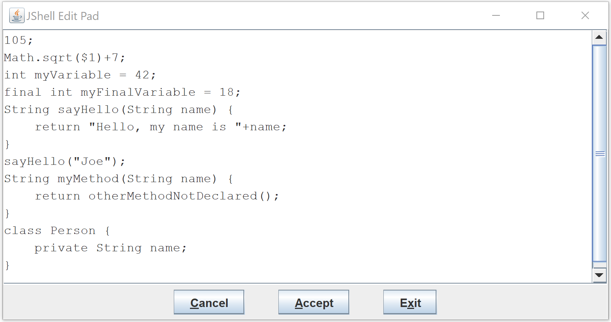
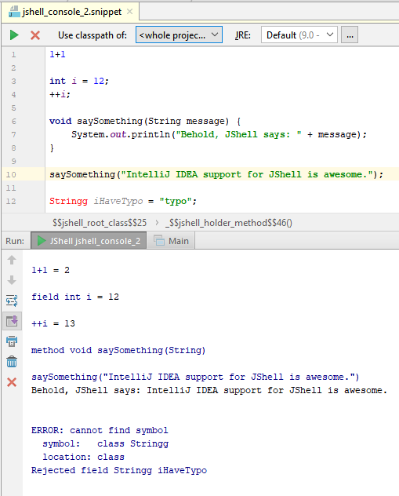

REPL
----

REPL stands for Read-Eval-Print-Loop. It may sound a bit cryptic, but it is just a fancy name for an interactive shell for a programming language. Many languages these days already have a REPL available. Even on JVM Groovy, Kotlin, Scala, and Clojure already have it. Java starting with version 9 finally has its very own REPL called JShell ([based on Java Enhancement Proposal 222](http://openjdk.java.net/jeps/222)).

Alright, so Java finally has its new shiny REPL. But what is it good for? Well, in a nutshell, it allows you to write independent snippets of Java code to the console (READ), immediately execute them (EVAL), then see the results (PRINT) and continue remembering what you already wrote (LOOP). It is a perfect tool if you want to try a piece of code quickly, draft an algorithm, check how some method behaves for unusual input, create and test a code snippet for your blog post etc. You just quickly try some throwaway code and immediately see the results. The best part is - it does not require most of the Java boilerplate.

While prototyping and quick code verification are important, there is another reason why having a REPL is useful. Especially in a verbose language full of boilerplate such as Java. Imagine you are teaching the Java language to complete beginners. What do you need to write a simple hello world program that just prints to the console? A lot of boilerplate such as a class with the main method. The problem is you need to expose the student to a lot of concepts they don\'t need to worry about right now such as classes, methods, static, string arrays and so on. Then when you make changes, you need to recompile and rerun the whole thing.

The interactive console does not require class with main and immediately shows you output. You can try various constructs and you see results quickly. You don\'t need any IDE. You can start programming with minimal setup and minimal knowledge of all the advanced concepts, learning just one construct at the time. This high barrier to entry also resulted in many schools and institutions abandoning Java as their introduction to programming language choice. The educational aspect was actually the primary motivation for the feature as stated in the JEP222:

> Immediate feedback is important when learning a programming language and its APIs. The number one reason schools cite for moving away from Java as a teaching language is that other languages have a \"REPL\" and have far lower bars to an initial "Hello, world!" program.

Running JShell
--------------

JShell is bundled with JDK 9+ installation. It resides in your JDK\\bin folder. For example on Windows it can be here:

```cmd
C:\Program Files\Java\jdk-9.0.4\bin\jshell.exe
```

To run it directly from the console, make sure JDK\\bin is added to your `PATH`. Then simply run `jshell` command. For now, let's use verbose mode with `-v`, which will help us better understand what's going on under the hood. Alternatively, you can run the executable directly from the bin directory. The last option is to use your IDE integration (see below - Support In IntelliJ IDEA).

```cmd
C:\Users\vojtech> jshell -v
| Welcome to JShell -- Version 10.0.1
| For an introduction type: /help intro

jshell>
```

Now you are in interactive mode and JShell evaluates anything you write. To quit JShell just type `/exit`.

Expressions
-----------
The simplest way to start with JShell is to write a simple expression. It can be a simple mathematical expression:

```jshelllanguage
jshell> 7*(3+12)
$1 ==> 105
|  created scratch variable $1 : int
```

As you can see the expression is immediately evaluated and the result is printed to the console. No need to declare any variables first. For our convenience, however, a temporary variable called $1 was created, which we can use from now on. Note that type of the variable was inferred to int.

However, expressions are not limited to simple mathematical ones like above. That would not be very useful. You can do pretty much anything you can do in Java.

```jshelllanguage
jshell> Math.sqrt($1)+7
$2 ==> 17.246950765959596
```

First of all, notice that we were able to use $1 variable from the previous example. The state is preserved between each command. Another noteworthy feature is that, as you can see, semicolons are optional in most cases.

Variables
---------
Even though JShell declares variables for us when the return value is not assigned to any variable, it is usually better to declare your own variables. If only for the sake of descriptive naming. You can declare them as you would local variables. 

```jshelllanguage
jshell> int myVariable = 42
myVariable ==> 42
|  created variable myVariable : int
```

Access modifiers and static/final are ignored for top-level variable and function declarations:

```jshelllanguage
jshell> final int myFinalVariable = 18
|  Warning:
|  Modifier 'final'  not permitted in top-level declarations, ignored
|  final int myFinalVariable = 18;
|  ^---^
myFinalVariable ==> 18
|  created variable myFinalVariable : int
```

After some time you may get confused what variables you already declared and what are their values. There is a specific command precisely for this - just type `/vars`.

```jshelllanguage
jshell> /vars
|    int $1 = 105
|    double $2 = 17.246950765959596
|    int myVariable = 42
|    int myFinalVariable = 18
```

If you are on Java 10 already, you can use [var instead of declaring the type explicitly](https://www.vojtechruzicka.com/java-10-var-local-variable-type-inference-jep-286/).

Methods 
-------
As we saw above, you can declare variables on the root level, not inside any class. You can do the same for methods. Again, you don't need to worry about any modifiers such as public, static or final. You simply start with the return type and the name of the method with possible parameters:

```jshelllanguage
jshell> String sayHello(String name) {
   ...> return "Hello, my name is "+name;
   ...> }
|  created method sayHello(String)

jshell> sayHello("Joe")
$7 ==> "Hello, my name is Joe"
|  created scratch variable $7 : String
```

In the example above, you can see we declared a method and then called it. Please note that unlike on the top level, inside methods and classes semicolons are not optional.

A common scenario is when a method uses another method or variable, which is not declared yet. It is called the forward reference and JShell allows you to do that. However, you cannot use such methods until all of its dependencies are also declared.

```jshelllanguage
jshell> String myMethod(String name) {
   ...> return otherMethodNotDeclared();
   ...> }
|  created method myMethod(String), however, it cannot be invoked until method otherMethodNotDeclared() is declared
```

Similar to `/vars` for variables, you can list all currently declared methods with `/methods`.

Types
-----
Top-level variables and methods are useful, but often you need to declare and use regular classes, enums or interfaces. You can do it as usual, nothing JShell specific here. Just keep in mind that in this case semicolons are required. You can list all declared types by `/types`.

```jshelllanguage
jshell> class Person {
   ...>     private String name;
            [more code here]
   ...> }
|  created class Person
```

Using external code
-------------------
Defining all your classes as in the example above is a tedious task. What's more, often you want to use already existing classes from JDK or even your own.

For the JDK classes, you can use `import` as usual. For your convenience, many of the common classes are already imported by default. Not only usual `java.lang`, but also `java.io`, `java.math`, `java.util` or `java.nio.file`. You can list all the current imports by `/import`. 

Of course, import is useless if JShell does not have access to the classes needed.

```jshelllanguage
jshell> import com.vojtechruzicka.*;
|  Error:
|  package com.vojtechruzicka does not exist
|  import com.vojtechruzicka.*;
|  ^
```

Your classes need to be on the classpath. The first option is using `CLASSPATH` environmental variable. Or you can specify classpath when launching JShell:

```jshelllanguage
jshell --class-path foo-1.0.0.jar
```

You can provide multiple jars separated by either `;` or `:` depending on your OS. Alternatively, you can define classpath directly from jshell:

```jshelllanguage
jshell> /env -class-path foo-1.0.0.jar
```

If you are using Java 9 module system, you can specify modules to be imported when starting JShell:

```jshelllanguage
jshell --add-modules some.module
```

Exceptions
----------
The good news is that JShell handles exceptions well. Whenever an exception occurs, JShell catches it, prints it and your session is not terminated. What's cool is that unlike in regular Java, it does not force you to handle checked exceptions, which removes a lot of try-catch boilerplate.

Saving and loading your work
----------------------------
When you work with JShell in more complicated use cases, it is often handy to be able to save your work and to continue later. Or to simply save your session for future reference. Fortunately JShell supports saving and loading sessions using `/save` and `/open commands`:

```jshelllanguage
jshell> /save myfile.jsh

jshell> /open myfile.jsh
```

Using an External Editor
------------------------
While you can write and edit everything directly in the JShell console, it is not always the best approach. The editing can be tedious and cumbersome. It is often better to use a dedicated external text editor. To open all the code snippets you entered so far in an external editor, type `/edit`.



Not very cutting edge, is it? Fortunately, you can configure your own editor to open when executing the `/edit` command. One way is to sen the environmental variable `JSHELLEDITOR`. Alternatively, you can set the editor directly from JShell. Use `-retain` option to persist this setting between sessions.

```jshelllanguage
jshell> /set editor myEditor -retain
|  Editor set to: myEditor
```

If your editor is not on `PATH`, you'll need to provide the full path to the executable.

Using JShell programmatically
----------------------------


Alternatives
------------

The first interesting alternative to plain JShell is called [Try Artifact](https://github.com/bhagatsingh/try-artifact). Instead of obtaining jar dependencies manually and adding them to the classpath, it allows you to download and use Maven artifacts directly from the console.

```jshelllanguage
jshell> /resolve org.apache.commons:commons-lang3:jar:3.4
|  Path /home/kawasima/.m2/repository/org/apache/commons/commons-lang3/3.4/commons-lang3-3.4.jar added to classpath
```

Another useful alternative is using a REPL directly in the browser. You can try either [Java REPL](http://www.javarepl.com/term.html) or [repl.it](https://repl.it).

Support In IntelliJ IDEA
------------------------

The good news is that if you use IntelliJ IDEA, you don't need to worry about having JShell on the classpath, as IDEA offers excellent integration with JShell out of the box directly in the IDE. You get all the useful features such as code completion, syntax highlighting, error detection and more.

To access JShell from IDEA,  go to *Tools → JShell Console...*.

What's also useful is that you can prepare all the code in advance and then just run it on demand rather than in the interactive console mode, which is often much more convenient.



Unlike when running directly from the console, IDEA automatically adds your current project to the classpath so you can work with your custom classes out of the box with no setup needed.

Conclusion
----------
Finally, even Java has its own REPL called JShell. It is a useful tool for quick prototyping, teaching or demonstration purposes. It is easy to use as it removes the need of much of the boilerplate Java normally requires. And if you use an IDE, which integrates JShell, the whole process gets even easier.