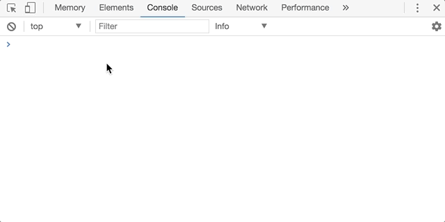
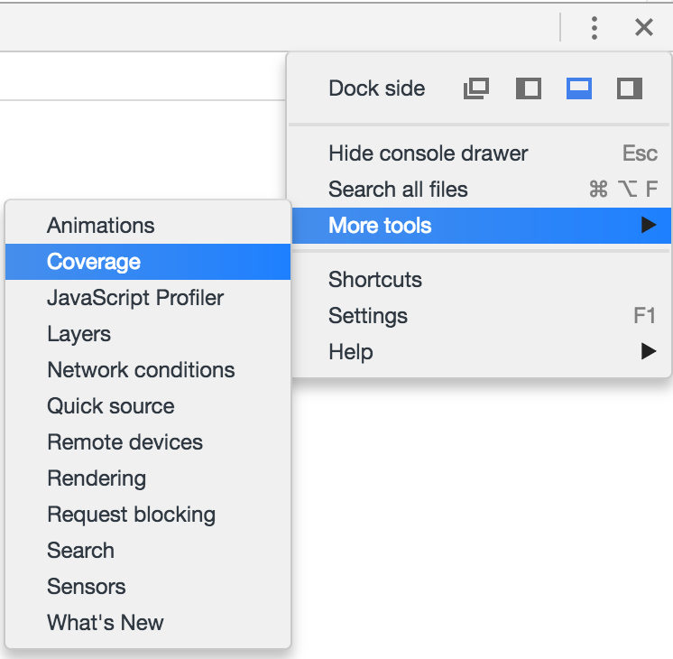
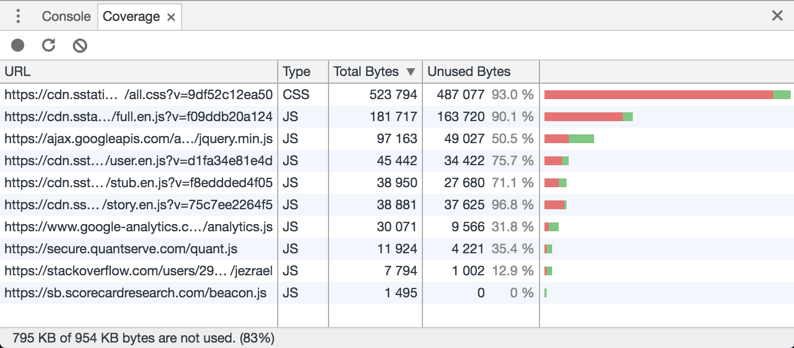
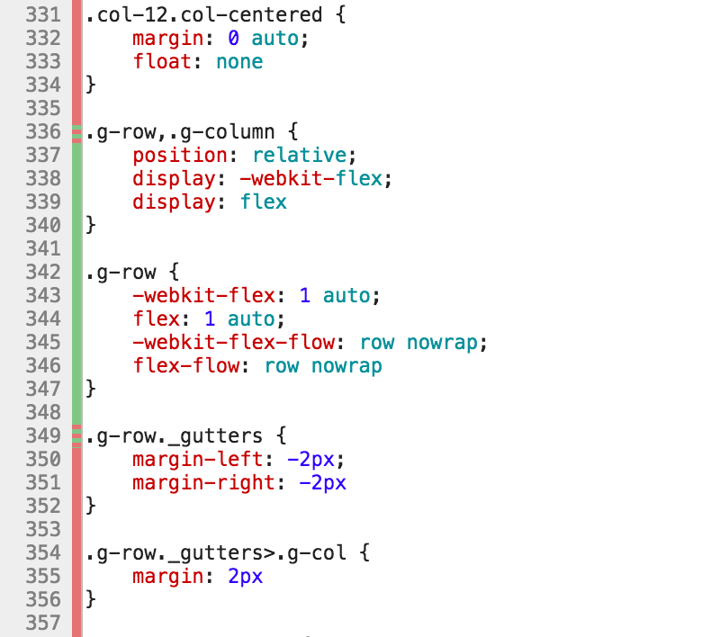

A new feature in Google Chrome Developer Tools allows you to measure coverage of CSS and Javascript files. This allows you to easily detect and remove unused portions of the code.
<!--more-->

Why is it useful
----------------

This feature was added in Google [Chrome 59](https://developers.google.com/web/updates/2017/04/devtools-release-notes) along with several other useful features such as full-page screenshots and blocking of requests. It allows you to record your session and when you are done, you can check which parts of your Javascript and CSS code were actually used during the session and which not. Each application usually accumulates a lot of JS and CSS code over time and a significant amount of it usually consists of code which is no longer used. Removing this dead code is important as it will speed up the loading times of your pages. What\'s more, your code will become less complex, which will make the maintenance and further development of your application easier and less painful.

Enabling Code Coverage
----------------------

Code coverage is measured on a Coverage tab in Developer Tools. To open Dev Tools press *⌘+*⌥*+I* (Mac) or *Control+Shift+I* (Windows, Linux). After this, you can access the Coverage from the Command Menu:*⌘+⇧+P* (Mac) or *Ctrl+Shift+P* (Windows, Linux) and then typing *Show Coverage*.

Alternatively, you can show the *Coverage* tab from Dev Tools menu by choosing *More tools → Coverage*.

When you manage to open the coverage tab, it will look like this:

Capturing Code Coverage
-----------------------

After opening the *Coverage* tab, you just need to press the record button (*Instrument Coverage*). Then you start to execute the desired use case. That is - you start to navigate the application, click buttons, fill forms and such. When you are finished you just press the button again to stop recording and show the coverage results. This is an example of  coverage results from browsing stackoverflow.com:

As you can see the table shows all the JS and CSS files which were downloaded during my session there. Each file contains information how big portion of the file was actually used in my session - both as percentage and size in bytes. On the very bottom in the status bar, there is a summary. You can tell that whole 83% was not used, that is 795 KB.

This is a nice overview, but you can actually display a per-line report of each of these files by double-clicking a row in the summary table:

Green lines mean that the code on the line was executed fully, red lines were not used during the recording session at all. Red/green lines were executed partially - only some fraction of the code was used, but not all.

Dynamic coverage
----------------

When using the coverage feature you need to be careful not to jump to conclusions too quickly. Coverage data shown is gathered dynamically based on your behavior and actions in your application. That means it is gathered and computed only based on actions you actually performed during your recorded session. Many elements on the page are usually rendered dynamically only under certain conditions. Some of them may be rendered only in certain corner cases which rarely occur and which you did not encounter while recording the session. Such code would be marked as unused, but you cannot really remove it as it would be missing in some scenarios. Always be careful when removing portions of code that you consider unused as it always does not have to be the case.

Conclusion
----------

Google Chrome\'s new feature adds integrated support for calculating dynamic code coverage for Javascript and CSS files, which can be used to detect unused code or code which is used just in some specific scenarios. Such code is a good candidate for removal or Lazy Loading, where you can greatly speed up initial load time for your application.
