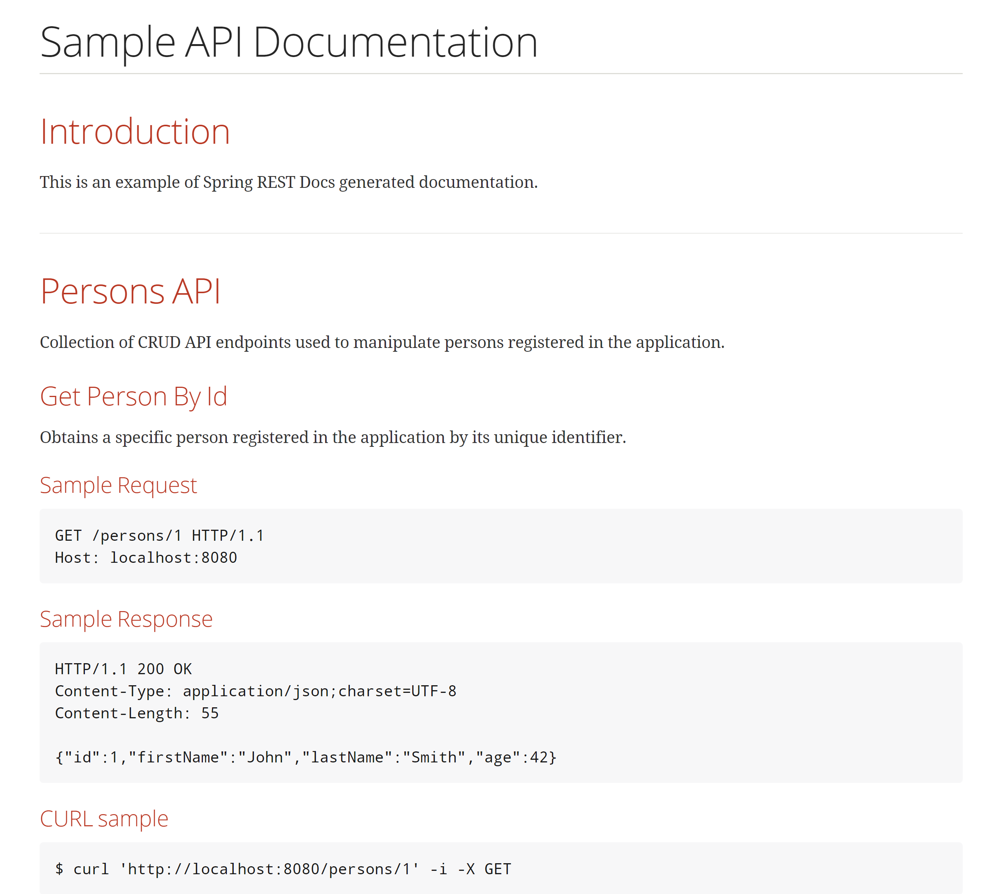
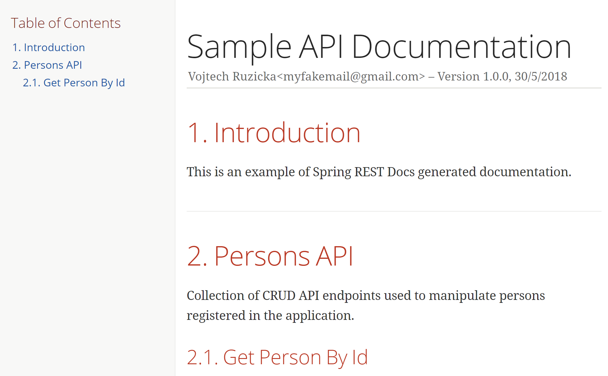
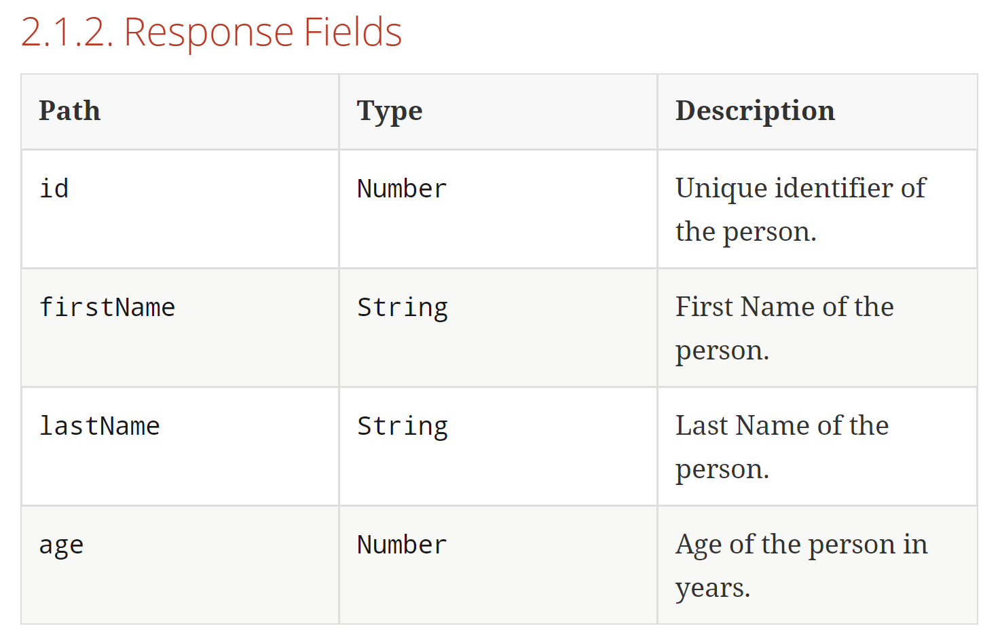

## SpringFox And Swagger
Traditional and very popular approach to documenting your REST API is Swagger (aka OpenAPI), which I covered in detail in one of my previous articles.

<div class="linked-post"><h4 class="front-post-title" style="margin-bottom: 0.375rem;"><a href="/documenting-spring-boot-rest-api-swagger-springfox/" style="box-shadow: none;">Documenting Spring Boot REST API with Swagger and SpringFox</a></h4><small class="front-post-info"><span class="front-post-info-date">16 February, 2018</span><div class="post-tags"><ul><li><a href="/tags/rest"><!-- react-text: 578 -->#<!-- /react-text --><!-- react-text: 579 -->REST<!-- /react-text --></a></li><li><a href="/tags/spring"><!-- react-text: 582 -->#<!-- /react-text --><!-- react-text: 583 -->Spring<!-- /react-text --></a></li><li><a href="/tags/java"><!-- react-text: 586 -->#<!-- /react-text --><!-- react-text: 587 -->Java<!-- /react-text --></a></li></ul></div></small><div><a class="front-post-image" href="/documenting-spring-boot-rest-api-swagger-springfox/"><div class=" gatsby-image-outer-wrapper" style="position: relative;"><div class=" gatsby-image-wrapper" style="position: relative; overflow: hidden;"><div style="width: 100%; padding-bottom: 66.6667%;"></div><noscript></noscript></div></div></a><span class="front-post-excerpt">How to document your Spring Boot REST APIs using Swagger with SpringFox?</span></div></div>

It is a powerful tool, which can be useful especially when you want to effortlessly generate your docs for your existing API. It will detect all the endpoint, input and output parameters automatically and generate the docs. However, if you want to provide custom descriptions of all the edpoints and fields, you'll end up with polluting your code with a LOT of annotations. The vas majority of your Controller and Model classes will be polluted with documentation-specific annotations, which will make them hard to read. In the example below, everything except the three highlighted lines is REST API documentation specific.

```java{8,9,12}
@ApiOperation("Creates a new person.")
@ApiResponses(value = {
    @ApiResponse(code = 200, message = "Success", response = Person.class),
    @ApiResponse(code = 401, message = "Unauthorized"),
    @ApiResponse(code = 403, message = "Forbidden"),
    @ApiResponse(code = 404, message = "Not Found"),
    @ApiResponse(code = 500, message = "Failure")})
@RequestMapping(method = RequestMethod.POST, produces = "application/json")    
public Person createPerson(
        @ApiParam("Person information for a new person to be created.")
        @RequestBody Person person) {
    return personService.createPerson(person);
}
```

## Spring REST Docs
Spring REST Docs take a different approach. Instead of infesting your controllers and model with documentation annotations, it moves all the documentation information elswhere. To your tests. To be precise - to the tests of your Controllers. It is convenient, because for many people tests are the best place to look to when trying to understand how some functionality works. Because unlike comments and documentation, test are always up to date. When your tests are out of date and no longer in sync with your implementation, they start to fail.

This is important because if your documentation is outdated, people no longer trust it and it is useless. Having outdated documentation is worse than having no documentation at all. That brings us to what's so cool about Spring Rest Docs. It is tightly integrated in your tests. And when your documentation gets different from your implementation, your tests start to fail. For example, if you add a field, which is not documented, your test no longer passes. If you remove a field and it is still in your documentation, the test no longer pass.

## Spring Test MVC
For the behavior described above to work, Spring Rest Docs need to be integrated with your test framework, which you use to test your REST API. There are various options in Spring, but Rest Docs support - Spring MVC Test, Spring Webflux's WebTestClient and RestAssured. In this tutorial I'll cover Spring MVC Test, but you can use any of them.

## Setting Up Spring Rest docs

### Starting repository
To follow this tutorial, you can use any Spring/Spring Boot application with REST controllers. You can either use your own or build on top of a sample [starter repository](https://github.com/vojtechruz/rest-docs-starter) I prepared for this purpose.

### Creating Spring MVC Tests
First, before diving deep into Spring Rest Docs specifics, you'll need some regular tests of your controllers. Let's create a simple test, which calls a controller's method and check whether HTTP response code is 200 OK and content type of the response is JSON. Of course, you can test much more, such as the response data, HTTP headers, cookies and so on.

```java
package com.vojtechruzicka.springrestdocs.controllers;

...

import static org.springframework.test.web.servlet.request.MockMvcRequestBuilders.get;
import static org.springframework.test.web.servlet.result.MockMvcResultMatchers.content;
import static org.springframework.test.web.servlet.result.MockMvcResultMatchers.status;

@RunWith(SpringRunner.class)
@SpringBootTest
public class PersonControllerTest {

    @Autowired
    private WebApplicationContext context;

    private MockMvc mockMvc;

    @Before
    public void setup() {
        mockMvc = MockMvcBuilders.webAppContextSetup(context).build();
    }

     @Test
     public void getPersonByIdShouldReturnOk() throws Exception {
         this.mockMvc.perform(MockMvcRequestBuilders.get("/persons/"))
                 .andExpect(status().isOk())
                 .andExpect(content().contentType("application/json;charset=UTF-8"));
     }

}
```

So far, nothing REST Docs specific, but this is the base we'll be building on.

### Adding the dependencies
First thing you'll need to do is provide a Spring Rest Docs dependency. You'll need to use a different one depending on whether you want to use Spring MVC Test, WebTestClient or RestAssured. For Spring MVC Tes you'll need the following (use the latest version).

```xml
<dependency> 
	<groupId>org.springframework.restdocs</groupId>
	<artifactId>spring-restdocs-mockmvc</artifactId>
	<version>2.0.1.RELEASE</version>
	<scope>test</scope>
</dependency>
```

Or for Gradle:

```
testCompile 'org.springframework.restdocs:spring-restdocs-mockmvc:2.0.1.RELEASE'
```

### Configuring your tests - Junit 4
The first step you need to do is to add a specific `@Rule` for rest documentation and then use it when building the mockMvc object. Only highlighted lines bellow were added, the rest is the original code sample we already saw.

```java{10-11,17}
@RunWith(SpringRunner.class)
@SpringBootTest
public class PersonControllerJunit4Test {

    @Autowired
    private WebApplicationContext context;

    private MockMvc mockMvc;

    @Rule
    public JUnitRestDocumentation jUnitRestDocumentation = new JUnitRestDocumentation();

    @Before
    public void setup() {
        mockMvc = MockMvcBuilders
                .webAppContextSetup(context)
                .apply(documentationConfiguration(this.jUnitRestDocumentation))
                .build();
    }

    ...
}
```

### Configuring your tests - Junit 5
For JUnit 5, the configuration is also easy, you just need to use `RestDocumentationExtension.class` extension in addition to Spring's one you would use normally. Then when constucting the mockMvc object, just apply the configuration. You're basically adding just the highlighted lines in the example below.

```java{2,12}
@SpringBootTest
@ExtendWith({ RestDocumentationExtension.class, SpringExtension.class})
public class PersonControllerJunit5Test {

    private MockMvc mockMvc;

    @BeforeEach
    public void setUp(WebApplicationContext webApplicationContext,
                      RestDocumentationContextProvider restDocumentation) {
        this.mockMvc = MockMvcBuilders
                .webAppContextSetup(webApplicationContext)
                .apply(documentationConfiguration(restDocumentation))
                .build();
    }

    ...
}
```

## Generating the Documentation
Now when we have the test configuration ready, it's time to write some documentation. First thing you need to do is to provide a command to generate the documentation in each test method. Just add `andDo(document("[documentation snippet's name]"))`. Then you need to replace `MockMvcRequestBuilders` with   `RestDocumentationRequestBuilders`.

```java{4,8}
    @Test
    public void getPersonByIdShouldReturnOk() throws Exception {
        this.mockMvc.perform(
                RestDocumentationRequestBuilders
                .get("/persons/1"))
                .andExpect(status().isOk())
                .andExpect(content().contentType("application/json;charset=UTF-8"))
                .andDo(document("persons/get-by-id"));
    }
```

Now let's run the tests to make sure everything works fine. Your tests should pass. Now in your `target/generated-snippets` should be a sub-folder with a name matching the string you provided in `andDo(document("[documentation snippet's name]"))`. Inside, there should be a bunch of `.adoc` files.


If you dont't want to provide snippet's name manually, you can provide placeholders, such as:

```java
andDo(document("{ClassName}/{methodName}")
```

### AsciiDoc vs Markdown 
The files inside are fragments of your documentation. They contain information such as HTTP request and response or curl commands to call your endpoints.

The resulting API documentation should be, of course, HTML. But as you can see, it is in a different format now. it's called AsciiDoc and is very similar to [MarkDown](https://www.markdownguide.org/getting-started). That means simple makrup language for text formatting written in plain text. MarkDown is widespread, well known language, so why to introduce another one? Why not to stick with MarkDown?

[Why You Shouldn’t Use Markdown for Documentation](http://ericholscher.com/blog/2016/mar/15/dont-use-markdown-for-technical-docs/#why-you-shouldn-t-use-markdown-for-documentation) sums the reasons pretty well. 

>Because the original Markdown is so limited, every popular tool built on top of Markdown implements what is called a [“flavor”](https://github.com/commonmark/CommonMark/wiki/Markdown-Flavors) of Markdown. This sounds great, except that every tool implements a different flavor. Even tools that do similar things with the language use different syntax for it!
...
In the last few years, [Commonmark](http://commonmark.org/) was developed as a standardized Markdown. This is great, and should solve lots of problems! Except that nobody has adopted it...

You can read more about the differences in [this comparison](https://github.com/asciidoctor/asciidoctor.org/blob/master/docs/_includes/asciidoc-vs-markdown.adoc).

### Converting AsciiDoc
Since AsciiDoc cannot be directly rendered by a browser, we need a way to convert the documentation from AsciiDoc to HTML. There's a tool called AsciiDoctor, which is also [available as a Maven plugin](https://github.com/asciidoctor/asciidoctor-maven-plugin). Just include the following in your `pom.xml` file.

```xml
<build>
	<plugins>
		<plugin> 
			<groupId>org.asciidoctor</groupId>
			<artifactId>asciidoctor-maven-plugin</artifactId>
			<version>1.5.5</version>
			<executions>
				<execution>
					<id>generate-docs</id>
					<phase>prepare-package</phase> 
					<goals>
						<goal>process-asciidoc</goal>
					</goals>
					<configuration>
						<backend>html</backend>
						<doctype>book</doctype>
					</configuration>
				</execution>
			</executions>
			<dependencies>
				<dependency> 
					<groupId>org.springframework.restdocs</groupId>
					<artifactId>spring-restdocs-asciidoctor</artifactId>
					<version>2.0.1.RELEASE</version>
				</dependency>
			</dependencies>
		</plugin>
	</plugins>
</build>
```

By default, this plugin does not run in any of the Maven lifecycle phases. So you need to bind it to one. Prepare-package is convenient if you want your generated documentation to be included in the resulting package and for example being served by Spring Boot as static resources.

### Putting the snippets together
Having `.adoc` snippets and AsciiDoctor maven plugin is still not enough. You need to provide more more AsciiDoc files, which will 'glue' together your generated snippets. In these files you can put any additional documentation and description needed by your users and you can choose which snippets to include and which not.

This is one of the advantages over good old Swagger. It is not just documenting API endpoints, but you can include huge chunks of additional documentation or even whole pages. This means you can combine traditional documentation with plain API docs.

What you need to do is to create a directory `src/main/asciidoc` and create your new `.adoc` file there.

When you run `mvn package`, all `.adoc` files from `src/main/asciidoc` will be converted to HTML and copied to `target/generated-docs`. Lets create a file called `src/main/asciidoc/index.adoc`.

```asciidoc
= Sample API Documentation

== Introduction
This is an example of Spring REST Docs generated documentation.

== Persons API
Collection of CRUD API endpoints used to manipulate persons registered in the application.

=== Get Person By Id
Obtains a specific person registered in the application by its unique identifier.

==== Sample Request
include::{snippets}/persons/get-by-id/http-request.adoc[]

==== Sample Response
include::{snippets}/persons/get-by-id/http-response.adoc[]

==== CURL sample
include::{snippets}/persons/get-by-id/curl-request.adoc[]
```

As you can see, you can divide the document to any number of sections and provide any text you want. When you want to use previously generated snippets you just use include statement like this `include::{snippets}/persons/get-by-id/curl-request.adoc[]`. Now just run maven build to make sure this AsciiDoc file is converted to HTML.

```commandline
mvn clean package
```

Now the resulting file should be available under `target/generated-docs/index.html` and it will look like this:



So far so good. Now let's tweak it a bit more. Let's add information about the author and version, add the table of contents to be displayed on the left side and finally automatic numbering of section headings. Just add the highlighted lines bellow the document heading.

```asciidoc{2-5}
= Sample API Documentation
Vojtech Ruzicka<myfakemail@gmail.com>
1.0.0, 30/5/2018
:toc: left
:sectnums:
```



To learn more about writing AsciiDoc, check the [user's manual](https://asciidoctor.org/docs/user-manual/).

## Documenting path params
We generated some documentation already, but so far it contains just a sample request and response and not much more. There's much more, which needs to be documented though.

Let's document the following endpoint more:

```java
    @RequestMapping(method = RequestMethod.GET, path = "/{id}", produces = "application/json")
    public Person getPersonById(@PathVariable int id) {
        return personService.getPersonById(id);
    }
```

First, let's document the PathVariable, that means that id of the person is passed in the url as `/persons/{id}`.

```java{7}
@Test
public void getPersonByIdShouldReturnOk() throws Exception {
    this.mockMvc.perform(RestDocumentationRequestBuilders.get("/persons/{id}", 1))
        .andExpect(status().isOk())
        .andExpect(content().contentType("application/json;charset=UTF-8"))
        .andDo(document("persons/get-by-id",
               pathParameters(parameterWithName("id").
               description("Identifier of the person to be obtained."))));
}
```

When you run maven build again, your HTML documentation does not change. The reason is that you just generated a new snippet called `path-parameters.adoc`, but you still need to include it in your `index.adoc` file. Let's add a new section then:

```asciidoc
==== Path Parameters
include::{snippets}/persons/get-by-id/path-parameters.adoc[]
```

If you build again, you should see a new section about path params in your documentation.


# Documenting request and response payload
Our controller's method getPersonById() returns a person represented as JSON. 

```json
{
  "id": 1,
  "firstName": "John",
  "lastName": "Smith",
  "age": 42
}
```

Let's document all the fields using `responseFields()` metod:

```java{9-15}
@Test
public void getPersonByIdShouldReturnOk() throws Exception {
    this.mockMvc.perform(RestDocumentationRequestBuilders.get("/persons/{id}", 1))
        .andExpect(status().isOk())
        .andExpect(content().contentType("application/json;charset=UTF-8"))
        .andDo(document("persons/get-by-id",
            pathParameters(parameterWithName("id")
                .description("Identifier of the person to be obtained.")),
            responseFields(
                fieldWithPath("id")
                    .description("Unique identifier of the person."),
                fieldWithPath("firstName")
                    .description("First Name of the person."),
                fieldWithPath("lastName")
                    .description("Last Name of the person."))
        ));
}
```

Now when you run the test again, it fails horribly:

```java
org.springframework.restdocs.snippet.SnippetException: 
The following parts of the payload were not documented:
{
  "age" : 42
}
```

This is one of the greatest features of Spring Rest Docs in action. We forgot to include one of the response fields to include in the documentation, but the API still returns it. In other words, we have undocumented field. If this happens, your tests start to fail, so your docs are always up to date. And it works the other way around too. If you document a field and your service no longer returns it, your tests start to fail. It's really powerful.

If you add documentation also for the `age` field and build again, it will generate yet another snippet - `response-fields.adoc`. You know the drill - include it in your docs and build again. And voila!



Documenting the request payload is pretty much same. Just use `requestFields()` method and `request-fields.adoc` fragment.

TODO request params and headers
TODO rest autodocs
TODO sample html output to the sample repo
TODO? serving in spring boot app static content


## Conclusion
While Swagger and SpringFox are not a bad choice, SpringFox offers some poweful benefits you should definitely consider. The main one is having your docs always up to date, because if the documentation goes out of sync, the tests start to fail. Other one is it will actually motivate you to write tests of your controllers as they are requried to write your documentation.

Also, with Spring rest docs it is much easier to write documentation not only of your API directly, but also add any other necessary info such as tables, blocks of text, images, code blocks and so on. And of course, your production code is no longer plagues by all the documentation annotations, which make it so hard to read.

Swagger on the other turn offers a powerful option to try your API directly in the documentation. Also, it will effortlessly generate basic information about your api without you writing anything. It can be useful for legacy codebase to have at least some documentation in no time. Of course, without custom descriptions and explanations, but at least it is something.