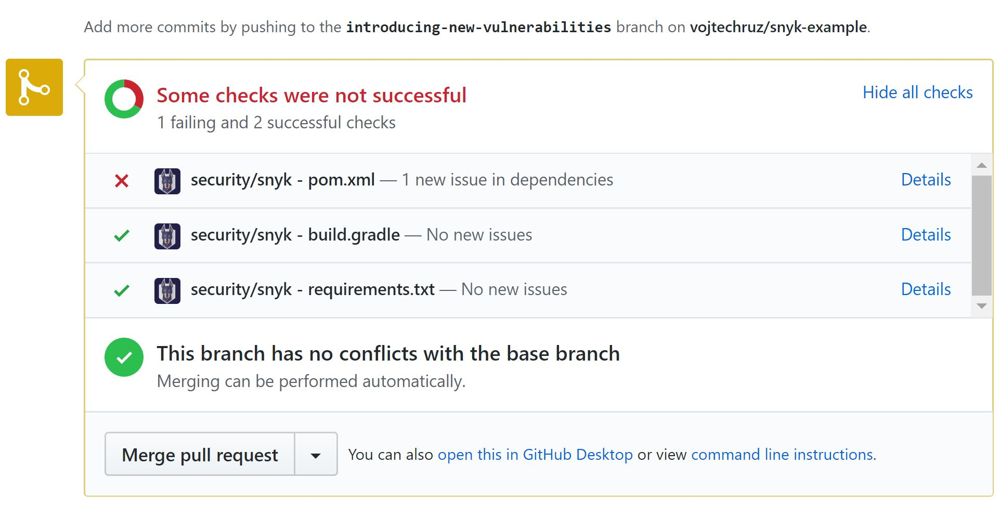
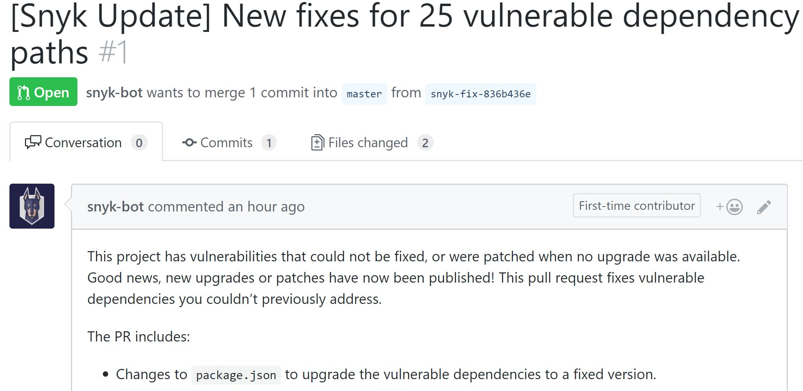

 How to detect and fix security vulnerabilities in your dependencies using Snyk?
<!--more-->

Introduction
------------

Earlier, I published post [Detecting dependencies with known vulnerabilities](http://vojtechruzicka.com/detecting-dependencies-known-vulnerabilities/), where I was describing how important is to make sure your third-party dependencies contain no security vulnerabilities. And how to achieve it with OWASP Dependency-Check. This post describes another tool, which can be used to eliminate vulnerable dependencies -- Snyk.

Unlike OWASP Dependency-Check, Snyk started as a tool for managing NPM dependencies. It is actively developed and new features are often introduced. Currently (as of November 2017), Snyk supports not only NPM but also Java (Maven and Gradle), Ruby, Scala, Python and Go. However, the support for NPM is still the strongest, so many nice features are not available for other languages.

Unlike Dependency check, which uses National Vulnerability Database, Snyk has its own Vulnerability DB, which is also available on GitHub.

Similar to Dependency Check, you can easily integrate Snyk with your Build and CI tools, so you can break the build when new security vulnerabilities are introduced.

Installation and Setup
----------------------

Before you can use Snyk, you need to install it using NPM. Make sure you have Node.js installed to do so. Then you can simply run:

```java
npm install –g snyk
```

To run Snyk tests, you need to have a Snyk account and be authenticated. Just run:

```java
snyk auth
```

This will open your browser's window, where you can create your account or sign in. Your security token will be downloaded and stored locally, so you don't have to auth the next time.

If you want to use Snyk on your CI server, you'll not be able to use this approach. In such case, you need to create your account on [https://snyk.io](https://snyk.io/) and then you can go to My Account → General, where you can find your API token. Then just simply run Snyk auth with your token:

```java
snyk auth [your token here]
```

Alternatively, you can store auth token directly in an environmental variable SNYK\_TOKEN.

In case you want to scan your NPM dependencies, you also need to run *npm install* now before you can perform vulnerability tests. For Python dependencies, you'll need to run:

```java
pip install -r requirements.txt
```

Running Test
------------

Once you have your environment set up, you can run your tests. Let\'s start with:

```xml
snyk test
```

Snyk fetches the latest data from its own Vulnerability DB and checks all your dependencies for know vulnerabilities. The output may look something like this:

```java
✗ Medium severity vulnerability found on org.apache.poi:poi@3.0-FINAL
- desc: XML Entity Expansion (XEE)
- info: https://snyk.io/vuln/SNYK-JAVA-ORGAPACHEPOI-31387
- from: com.vojtechruzicka:snyk-maven-example@1.0-SNAPSHOT > org.apache.poi:poi@3.0-FINAL
✗ Medium severity vulnerability found on xerces:xercesImpl@2.11.0
- desc: Denial of Service (DoS)
- info: https://snyk.io/vuln/SNYK-JAVA-XERCES-30183
- from: com.vojtechruzicka:snyk-maven-example@1.0-SNAPSHOT > xerces:xercesImpl@2.11.0
✗ High severity vulnerability found on xerces:xercesImpl@2.11.0
- desc: Denial of Service (DoS)
- info: https://snyk.io/vuln/SNYK-JAVA-XERCES-31497
- from: com.vojtechruzicka:snyk-maven-example@1.0-SNAPSHOT > xerces:xercesImpl@2.11.0
Tested 5 dependencies for known vulnerabilities, found 3 vulnerabilities, 3 vulnerable paths.
```

Monitoring for new vulnerabilities
----------------------------------

When running *snyk test,* you are only notified about the currently known vulnerabilities, which are already part of the Snyk vulnerability DB. New vulnerabilities are, however, discovered all the time. Dependencies previously considered safe can contain high severity issues in the blink of an eye.

Snyk allows you to monitor your application's dependencies continuously for newly discovered issues. You need to run *snyk monitor* command:

```java
snyk monitor
```

Snyk creates a snapshot of your dependencies and stores it. It then sends you an email whenever a new vulnerability, which affects you is discovered. You should run the monitor command every time you change your dependencies (e.g. after deploy job) to update the snapshot.

Addressing Issues
-----------------

### Update

If the vulnerability is not brand new, there is a good chance it was already fixed in a later version of your dependency. Updating dependency version is the easiest fix, but may not always be available. Snyk DB provides all the required information, so you can tell whether upgrading version will actually fix the vulnerability.

### Patch

Sometimes, unfortunately, official fix in the form of a new version for the vulnerability is not available. Maybe the dependency is no longer actively developed or it is just too early after the discovery. Fortunately, nothing is lost and there is a good chance you will be able to still resolve your issue.

Snyk patches are one of the cool features, which makes Snyk better than other similar services. For some dependencies, the Snyk team actually provides their own fix in the form of patch -- a minimal set of changes required to fix the security vulnerability. This feature is unfortunately currently available only for NPM dependencies.

How does it work? The problem is that after applying the patch locally, the changes would be overwritten the next time you would run *npm install*. To prevent this, Snyk introduces a special .*snyk* file, which contains information about all the patches which need to be applied. Then after installing local dependencies by *npm install*, you just need to run *snyk protect*.

It downloads and applies all the patches contained in the *.snyk* file. So you need to run it after *npm install* but before the build. You don't need to edit the *.snyk* file manually, Snyk Wizard will do it for you (see below).

### Ignore

You can decide to [ignore](https://snyk.io/docs/using-snyk#ignore) a known vulnerability by running *snyk ignore*.

This may be handy in case there is currently no update or patch. Snyk will notify you via email when a fix is available later. It is a good idea always to provide a reason for ignoring (using *--reason*) and the duration short enough (using *--expiry*) so the issue is not buried permanently. By default ignore will expire after 30 days. Ignored issues are stored in the .snyk file.

Snyk Wizard
-----------

Running snyk test will find all the security vulnerabilities for you. It will not, however, fix them for you. Snyk Wizard comes to the rescue. You can run it with:

```java
snyk wizard
```

This will go through all your vulnerable dependencies and offer:

1.  Update the dependency to a newer version, which fixes the issue, if available
2.  Apply a patch if available
3.  Ignore
4.  Skip for now

All your decisions will be applied -- *package.json* file will be changed to include the new dependencies and a *.snyk* file will be created with all the patches and ignores. Finally, the *snyk monitor* will be run to create a snapshot of your dependencies, so you will be notified in the future if a new vulnerability or fix is added. However, currently, only NPM dependencies can be handled by the *snyk wizard*.

Wizard\'s console output can look like this:

``` java
C:\projects\snyk-example>snyk wizard
Snyk's wizard will:
  * Enumerate your local dependencies and query Snyk's servers for vulnerabilities
  * Guide you through fixing found vulnerabilities
  * Create a .snyk policy file to guide snyk commands such as `test` and `protect`
  * Remember your dependencies to alert you when new vulnerabilities are disclosed
Querying vulnerabilities database...
Tested 1158 dependencies for known vulnerabilities, found 11 vulnerabilities, 30 vulnerable paths.

? 5 vulnerabilities introduced via aegir@12.0.0
- info: https://snyk.io/package/npm/aegir/12.0.0
  Remediation options (Use arrow keys)
> Upgrade to aegir@12.1.2 (triggers upgrade to debug@3.1.0, growl@1.10.3, tunnel-agent@0.6.0)
  Review issues separately
  Set to ignore for 30 days (updates policy)
  Skip
```

Integrations
------------

While snyk Command Line Interface is pretty cool, snyk offers much more. It integrates with a wide range of external services.

Currently, snyk supports GitHub, GitHub Enterprise, GitLab and BitBucket Server as Version Control. From PaaS, there is Heroku, CloudFoundry, Pivotal Web Services and IBM Bluemix. There is even support for AWS Lambda (Google Could platform to be supported soon). Notifications about new vulnerabilities can be delivered via Slack or soon as JIRA tickets.

### GitHub

Let's closely look how such integration works. We\'ll use Github as an example. After authenticating with your GitHub account, you will see your project in the Projects section of the Snyk webpage.


It shows all your dependencies and issues by severity. It will not only monitor your master branch, but it will also check all the pull requests to be sure that they do not introduce any new vulnerabilities.



What's even cooler, after testing your project Snyk will check its database whether there are any solutions for the issues found. That is -- if it can find any new versions fixing the vulnerabilities found. Or at least, if there are any patches. If there is something, what can be done, it creates automatically a Pull Request, which introduces the fix. How cool is that? You can see example PR [here](https://github.com/vojtechruz/snyk-example/pull/1):



As with the Wizard, this is unfortunately only available for NPM projects though. Hopefully, other types will also be supported soon.

If your project is free of vulnerabilities, you can even include this nice badge: 


Conclusion
----------

Making sure your dependencies are up to date and contain no security vulnerabilities is very important and often overlooked. Snyk is a cool tool, which can help you with that. It is in some aspects similar to OWASP Dependency-Check [described in the previous article](http://vojtechruzicka.com/detecting-dependencies-known-vulnerabilities/). It has some nice features on top of what Dependency Check offers. Integration with a wide range of cloud services and version control systems. What\'s great is that it not only finds the vulnerabilities but directly offers means to fix them in the form of updates or patches. Hell, it can even automatically create a Pull Request for that. The downside is that many of the cool features are currently available just for node dependencies and not others like Java. We can only hope this will change soon.
